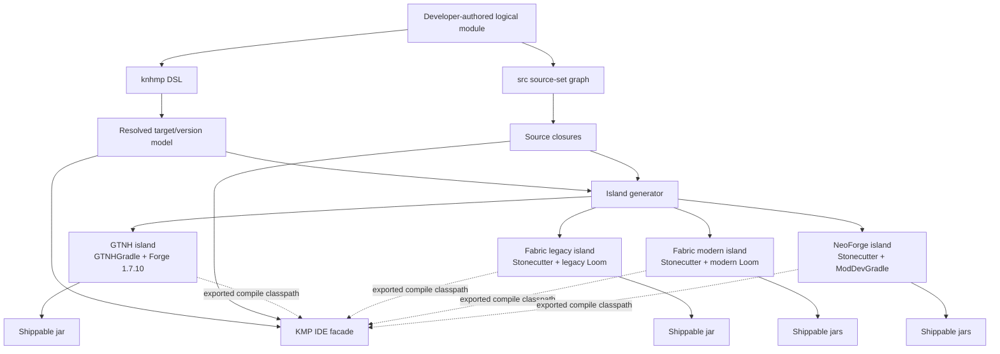
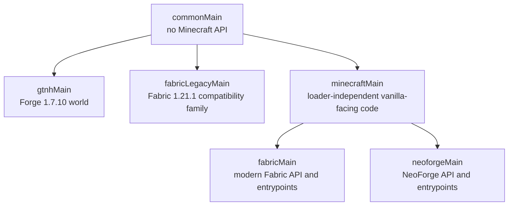
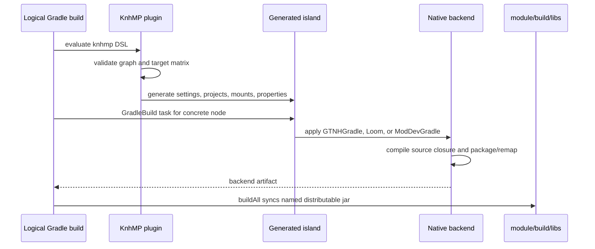

# KnhMP Architecture

> Status: initial implementation and extraction reference.
>
> This document describes the implementation in this plugin project, not a hypothetical API. Update it whenever an implementation invariant changes.

## 1. What KnhMP is

KnhMP is a Gradle plugin for writing one logical Minecraft mod module and compiling it for multiple Minecraft versions and mod loaders.

It provides a Kotlin Multiplatform-like source-set graph:

- `commonMain` contains code with no Minecraft or loader API;
- loader or compatibility-family leaves contain platform code;
- optional intermediate source sets contain code shared by a subset of leaves;
- `dependsOn` controls source inheritance;
- target and Minecraft-version scopes control plugins and dependencies.

KnhMP is **not** Kotlin Multiplatform as a production compiler. Minecraft build plugins are mutually incompatible enough that GTNHGradle, different Loom generations, and ModDevGradle cannot safely coexist in one Gradle project or plugin classloader. KnhMP therefore separates the logical module from the physical compiler projects:

1. The normal Gradle module declares the source graph and target matrix.
2. KnhMP generates isolated compiler builds under `<module>/.knhmp/`.
3. Each compiler build applies exactly one compatible Minecraft build-tool stack.
4. The normal module exposes a lightweight Kotlin Multiplatform facade to IntelliJ.
5. Only the isolated compiler builds produce distributable jars.

In one sentence:

> KnhMP is a source-graph and build-orchestration layer over isolated native Minecraft build tools.

It does not replace GTNHGradle, Loom, ModDevGradle, Stonecutter, Mixin, or the mod loaders. It projects one declaration into those tools.

## 2. The problem it solves

A multi-version Minecraft project has several independent axes:

| Axis | Examples | Why it matters |
| --- | --- | --- |
| Loader | GTNH Forge, Fabric, NeoForge | Different metadata, dependencies, runs, packaging, and runtime APIs |
| Minecraft version | `1.7.10`, `1.21.1`, `26.1`, `26.2` | Different game APIs, mappings, Java requirements, and dependency versions |
| Build-tool generation | GTNHGradle, legacy Loom, modern Loom, ModDevGradle | Different Gradle plugins and often incompatible plugin classpaths |
| Source compatibility | common, legacy Fabric, modern vanilla-facing, loader-specific | Some code is reusable across all outputs; some is reusable only within a family |
| Bytecode/runtime | Java 17, Java 21, modern JDK toolchains | Source compatibility and the JVM used to run Gradle are not the same as emitted bytecode |

A single flat source set duplicates code. A single Gradle project that applies every build plugin is fragile or impossible. A repository containing one manually maintained subproject per `(module, loader, version)` duplicates build logic and makes cross-module dependencies hard to keep aligned.

KnhMP centralizes the logical model while retaining the isolation demanded by the underlying tools.

## 3. Core model and terminology

| Term | Meaning |
| --- | --- |
| **Logical module** | A user-authored Gradle subproject such as `:framework` or `:hello`. It owns canonical sources and one `knhmp {}` declaration. |
| **Source set** | A named directory and graph node such as `commonMain`, `fabricLegacyMain`, or `minecraftMain`. It may depend on other source sets. |
| **Closure** | A leaf plus all of its recursive parents, in parent-first order. This is the complete source input for one compiler node. |
| **Target** | A loader/backend: currently `gtnh`, `fabric`, or `neoforge`. |
| **Variant** | One target at one Minecraft version, for example Fabric `26.2`. |
| **Compatibility family** | Variants that can use the same leaf source set and build-plugin generation. Fabric `1.21.1` and Fabric `26.x` are separate families. |
| **Island** | A generated, independent Gradle build using one compatible build-tool stack. An island may contain one or multiple Minecraft-version nodes. |
| **Node** | One concrete `(logical module, target, Minecraft version)` compiler project inside an island. |
| **IDE facade** | The Kotlin Multiplatform model exposed by the logical module for source navigation, code insight, and classpaths. It does not ship jars. |
| **Active variant** | The version selected for an unversioned run task and IDE classpath export within a target. |
| **Canonical source** | A file below `src/<sourceSet>/`; it is owned by the logical module and never generated into `.knhmp`. |

## 4. Architecture at a glance



The separation is deliberate:

- the logical build answers **what exists** and **what depends on what**;
- an island answers **how one compatible toolchain compiles it**;
- the IDE facade answers **how an editor understands the graph without importing every generated build**.

## 5. Repository layout

A minimal monorepository using KnhMP looks like this:

```text
repository/
├── settings.gradle.kts
├── build.gradle.kts
├── gradle.properties
├── gradle/
│   └── libs.versions.toml
├── knhmp/
│   ├── build.gradle.kts
│   ├── ARCHITECTURE.md
│   └── src/main/
│       ├── java/io/example/knhmp/...
│       └── kotlin/io/example/knhmp/...
└── modules/
    ├── framework/
    │   ├── build.gradle.kts
    │   └── src/
    │       ├── commonMain/kotlin/...
    │       ├── gtnhMain/kotlin/...
    │       ├── fabricLegacyMain/kotlin/...
    │       ├── fabricMain/kotlin/...
    │       └── neoforgeMain/kotlin/...
    └── hello/
        ├── build.gradle.kts
        ├── src/
        │   ├── commonMain/kotlin/...
        │   ├── gtnhMain/
        │   │   ├── java/.../mixin/...
        │   │   └── resources/
        │   │       ├── mcmod.info
        │   │       └── mixins.hello.json
        │   ├── fabricLegacyMain/
        │   │   ├── java/.../mixin/...
        │   │   └── resources/
        │   │       ├── fabric.mod.json
        │   │       └── hello.mixins.json
        │   ├── minecraftMain/
        │   │   ├── kotlin/...
        │   │   ├── java/.../mixin/...
        │   │   └── resources/hello.mixins.json
        │   ├── fabricMain/resources/fabric.mod.json
        │   └── neoforgeMain/resources/META-INF/neoforge.mods.toml
        └── .knhmp/                 # generated; disposable; do not edit
```

The root build includes only logical modules. Generated compiler projects are intentionally not normal root subprojects.

```kotlin
// settings.gradle.kts
rootProject.name = "my-mods"

enableFeaturePreview("TYPESAFE_PROJECT_ACCESSORS")

pluginManagement {
    repositories {
        gradlePluginPortal()
        mavenCentral()
    }
}

file("modules").listFiles()
    .orEmpty()
    .filter { it.isDirectory && it.resolve("build.gradle.kts").isFile }
    .sortedBy { it.name }
    .forEach { moduleDirectory ->
        include(":${moduleDirectory.name}")
        project(":${moduleDirectory.name}").projectDir = moduleDirectory
    }
```

KnhMP adds no repositories to logical modules. Declare the facade repositories once in settings (`dependencyResolutionManagement`, ideally with `RepositoriesMode.FAIL_ON_PROJECT_REPOS`), including every repository a module's `api` dependencies need, because consumers resolve them too. Generated islands declare their own backend repositories.

Logical modules exchange island models in memory, so every module must load KnhMP from one plugin classloader. Declare KnhMP and any other plugin applied by a module in the root build script with `apply false`:

```kotlin
// build.gradle.kts
plugins {
    base
    id("io.github.fopwoc.knhmp") apply false
    alias(libs.plugins.compose.compiler) apply false
}
```

Consumers currently disable configuration-cache and parallel execution. Nested Gradle builds and shared active-version state are not yet designed for either feature.

```properties
# gradle.properties
org.gradle.configuration-cache=false
org.gradle.parallel=false
kotlin.mpp.applyDefaultHierarchyTemplate=false
kotlin.suppressGradlePluginWarnings=KotlinSourceSetTreeDependsOnMismatch
```

## 6. Source graph

### 6.1 A representative graph



This graph is declared as follows:

```kotlin
sourceSets {
    commonMain {
        jvmTarget = 17
    }
    gtnhMain {
        dependsOn(commonMain)
        jvmTarget = 8
    }
    fabricLegacyMain {
        dependsOn(commonMain)
        jvmTarget = 21
    }

    val minecraftMain = sourceSet("minecraftMain").apply {
        dependsOn(commonMain)
        jvmTarget = 21
    }
    fabricMain {
        dependsOn(minecraftMain)
    }
    neoforgeMain {
        dependsOn(minecraftMain)
    }
}
```

`minecraftMain` is not a reserved name. It is an ordinary custom intermediate source set; this repository calls it `modernMain`. Its architectural meaning in this project is “code compiled against Minecraft but not a loader API.” It is useful for vanilla-facing helpers and Mixins shared by compatible Fabric and NeoForge variants.

It does **not** mean that all Minecraft versions are interchangeable. A class that exists only in one version still needs a version-specific conditional or a separate compatibility family.

### 6.2 Closures

For the graph above, the effective source closures are:

| Leaf | Compiled source sets |
| --- | --- |
| `gtnhMain` | `commonMain`, `gtnhMain` |
| `fabricLegacyMain` | `commonMain`, `fabricLegacyMain` |
| `fabricMain` | `commonMain`, `minecraftMain`, `fabricMain` |
| `neoforgeMain` | `commonMain`, `minecraftMain`, `neoforgeMain` |

Sibling leaves are excluded by construction. Fabric code cannot accidentally enter a NeoForge jar merely because both live in the same logical module.

KnhMP validates that every parent exists and rejects source-set cycles. If no source sets are declared, it creates the conventional `commonMain` plus one default leaf for each configured target.

### 6.3 Where code should live

Use the highest source set whose entire descendant matrix can compile the code:

| Code uses | Correct home |
| --- | --- |
| Kotlin/JDK only | `commonMain` |
| Forge 1.7.10 or GTNH APIs/names | `gtnhMain` |
| Fabric 1.21.1 APIs or obfuscated-era-specific Mixin names | `fabricLegacyMain` |
| Vanilla Minecraft API shared by the configured modern Fabric and NeoForge nodes | `minecraftMain` |
| Fabric loader/API | `fabricMain` |
| NeoForge API | `neoforgeMain` |
| Only one incompatible version family | A dedicated leaf selected by that version scope |

“Loader-independent” is a source contract, not an enforced sandbox. Both real compiler islands still compile `minecraftMain`; accidental loader usage may compile in one island and fail in the other. The second compiler is the authoritative guard.

## 7. The module DSL

The following is a complete representative module. It intentionally shows the important separation between source graph, target-wide configuration, and version-specific configuration.

```kotlin
plugins {
    id("io.github.fopwoc.knhmp")
}

knhmp {
    modId = "hello"
    modName = "Hello"
    modGroup = "io.example.mods.hello"
    modVersion = "1.0.0"
    javaToolchain = 26

    // Applies to every target/version node of this logical module.
    dependencies {
        implementation(projects.framework)
    }

    sourceSets {
        commonMain { jvmTarget = 17 }
        gtnhMain {
            dependsOn(commonMain)
            jvmTarget = 8
        }
        fabricLegacyMain {
            dependsOn(commonMain)
            jvmTarget = 21
        }
        val minecraftMain = sourceSet("minecraftMain").apply {
            dependsOn(commonMain)
            jvmTarget = 21
        }
        fabricMain { dependsOn(minecraftMain) }
        neoforgeMain { dependsOn(minecraftMain) }
    }

    targets {
        gtnh {
            kotlin { stdlibVersion = "2.1.10" } // Forgelin's stdlib; implies apiVersion 2.1
            plugins {
                alias(libs.plugins.gtnh.convention)
            }
            dependencies {
                implementation(libs.forgelin)
            }
            mixins {
                packageName = "io.example.mods.hello.gtnh.mixin"
            }
            accessTransformers("META-INF/hello_at.cfg")
        }

        fabric {
            minecraft("1.21.1", "26.1", "26.2")

            dependencies {
                implementation(libs.slf4j.api)
                runtimeOnly(libs.fabric.language.kotlin)
            }
            mixins {
                packageName = "io.example.mods.hello.mixin"
            }

            minecraft("1.21.1") {
                sourceSet = "fabricLegacyMain"
                plugins { alias(libs.plugins.loom.legacy) }
                dependencies {
                    modImplementation(libs.fabric.loader)
                    modImplementation(libs.fabric.api.v1211)
                }
                mixins {
                    packageName = "io.example.mods.hello.fabriclegacy.mixin"
                }
            }

            minecraft("26.1", "26.2") {
                plugins { alias(libs.plugins.loom) }
                dependencies {
                    implementation(libs.fabric.loader)
                }
                accessWidener("hello.accesswidener")
            }
            minecraft("26.1") {
                dependencies { implementation(libs.fabric.api.v261) }
            }
            minecraft("26.2") {
                dependencies { implementation(libs.fabric.api.v262) }
            }
        }

        neoforge {
            minecraft("1.21.1", "26.1", "26.2")
            plugins { alias(libs.plugins.moddev) }
            mixins {
                packageName = "io.example.mods.hello.mixin"
            }
            accessTransformers("META-INF/accesstransformer.cfg")

            minecraft("1.21.1") {
                dependencies {
                    neoForge(libs.neoforge.v1211)
                    runtimeOnly(libs.kotlinforforge.neoforge.v5)
                }
            }
            minecraft("26.1") {
                dependencies {
                    neoForge(libs.neoforge.v261)
                    runtimeOnly(libs.kotlinforforge.neoforge.v6)
                }
            }
            minecraft("26.2") {
                dependencies {
                    neoForge(libs.neoforge.v262)
                    runtimeOnly(libs.kotlinforforge.neoforge.v6)
                }
            }
        }
    }
}
```

Identity defaults are intentionally convenient for initial adoption:

- `modId`: project name with hyphens removed;
- `modName`: `modId`;
- `modGroup`: `io.github.example.<modId>`;
- `modVersion`: the `modVersion` project property, else `VERSION` from the environment, else `git describe --tags --always --dirty --long` of the root project (an exact tag collapses to the tag), else `0.1.0-SNAPSHOT`; resolved once per repository so every module agrees;
- `repositoryUrl`: the `repositoryUrl` project property, else the web page of the root repository's `origin` remote, resolved once per repository;
- `archiveName`: project name, giving `<archiveName>-<target>[-<minecraftVersion>]-<modVersion>.jar`;
- `javaToolchain`: `26`.

Real projects should set stable identity explicitly.

## 8. Scopes and precedence

Build configuration can be declared at three levels:

```text
module-wide scope
└── target scope
    └── target + Minecraft-version scope
```

For a concrete node, KnhMP resolves scopes from broadest to narrowest.

| Configuration | Merge behavior |
| --- | --- |
| Dependencies | Concatenated in scope order |
| Plugins | Keyed by plugin ID; a narrower declaration replaces the wider declaration with the same ID |
| Kotlin API/language version | Narrowest declared value wins |
| Mixin configuration | Narrowest enabled declaration wins |
| Access transformers | Accumulated |
| Access widener | Narrowest declared value wins |

This allows one target-wide declaration with precise exceptions:

```kotlin
fabric {
    minecraft("1.21.1", "26.1", "26.2")
    dependencies { runtimeOnly(libs.fabric.language.kotlin) }

    minecraft("1.21.1") {
        sourceSet = "fabricLegacyMain"
        plugins { alias(libs.plugins.loom.legacy) }
    }

    minecraft("26.1", "26.2") {
        plugins { alias(libs.plugins.loom) }
    }
}
```

A variant declaration does not create a source set. It selects an existing source set. This is how a version is assigned to a compatibility family.

## 9. Island formation

An island exists to isolate incompatible build plugins. KnhMP groups variants using this key:

```text
(selected leaf source set, effective build plugin IDs and versions)
```

Dependencies do not split an island; build-plugin incompatibility does.

For the example module, the likely result is:

| Island | Nodes | Build stack |
| --- | --- | --- |
| GTNH | `1.7.10` | GTNHGradle/Forge |
| Fabric legacy | `1.21.1` | Stonecutter + legacy Loom |
| Fabric modern | `26.1`, `26.2` | Stonecutter + modern Loom |
| NeoForge | `1.21.1`, `26.1`, `26.2` | Stonecutter + ModDevGradle |

Different logical modules receive separate generated islands, but an inter-module dependency resolves to the exact matching node in the dependency module.

### 9.1 Generated directory

KnhMP writes islands beneath:

```text
modules/<module>/.knhmp/
```

Generated scripts contain absolute paths back to canonical sources and sibling island outputs. This is acceptable because `.knhmp` is local, disposable build state. It must not be published as source or edited by hand.

### 9.2 Generation flow



The generated build is implementation detail, but the native backend remains authoritative. If Loom rejects a mapping or ModDevGradle rejects a platform dependency, KnhMP should not mask that failure.

## 10. Backend projections

### 10.1 GTNH

The GTNH target is a single-project island for Minecraft `1.7.10`.

KnhMP generates the GTNHGradle convention setup and properties, mounts the `gtnhMain` closure, and invokes the backend's `reobfJar` task for the distributable jar. The development jar is the backend's `-dev` artifact.

Important properties:

- the Gradle runtime/toolchain remains owned by GTNHGradle;
- `enableModernJavaSyntax = modern` is enabled, so the project can compile modern Java syntax and bytecode newer than Java 8 for an lwjgl3ify runtime (this repository's GTNH code targets Java 24);
- the effective JVM target is still calculated from the source closure;
- GTNHGradle's code-style module (Spotless/Checkstyle) is disabled; code style is a repository-level concern, not a backend one;
- the Kotlin runtime is Forgelin: `kotlinx-coroutines` is excluded from mod and test classpaths because Forgelin shades it, and `kotlin { stdlibVersion }` pins `kotlin-stdlib` to the copy Forgelin embeds;
- tests run with `build/test-work` as working directory, since Forge classes write logs and configs there;
- GTNHGradle supplies UniMixins when Mixins are enabled;
- GTNHGradle runs the Mixin annotation processor, emits an SRG refmap, and writes the `MixinConfigs` manifest entry;
- access-transformer file names are forwarded to GTNHGradle.

KnhMP does not aim to preserve a stock Java 8-only Minecraft 1.7.10 runtime. A leaf may declare `jvmTarget = 8`, but if it inherits `commonMain` at 17, its effective target is 17.

### 10.2 Fabric

Fabric islands use Stonecutter to hold one or more version nodes and Loom to compile each node.

Each node must resolve exactly one versioned Loom plugin. The plugin applies these rules; this repository builds only Fabric `26.2`, and the `1.21.1` path is covered by the DSL tests, not by a real build:

- Fabric `1.21.1` uses plugin ID `fabric-loom` and `fabricLegacyMain`;
- Fabric `26.1` and `26.2` use plugin ID `net.fabricmc.fabric-loom` and `fabricMain`.

The legacy family uses the backend's remapped output and has a Mixin refmap. The modern family uses unobfuscated Mojang names and does not need a refmap. Fabric Loader provides the Mixin runtime in both cases.

KnhMP's current obfuscation rule is deliberately simple: version strings beginning with `1.` are treated as obfuscated, while `26.x` is treated as unobfuscated. This is an implementation rule to revisit if the supported version scheme expands.

Fabric access wideners are projected to `loom.accessWidenerPath`; the module still registers the widener in `fabric.mod.json`.

### 10.3 NeoForge

NeoForge islands use Stonecutter plus ModDevGradle. Each node supplies exactly one `neoForge(...)` platform dependency.

KnhMP generates:

- the ModDevGradle platform declaration;
- client and server runs;
- the mod source-set association;
- access-transformer inputs;
- the source/resource mounts for the selected closure.

Mixin configs are registered in `META-INF/neoforge.mods.toml`. Current NeoForge nodes use Mojang names and do not run a KnhMP-managed refmap pipeline.

The generated dependency-resolution attributes currently request target JVM 25 to match published NeoForge metadata. This does not change source bytecode: source closure targets still control emitted class-file versions.

## 11. Stonecutter's exact responsibility

Stonecutter selects and preprocesses source text for Minecraft-version nodes. It does not choose loader dependencies, plugin generations, Kotlin API levels, or runtime libraries; KnhMP's scopes do that.

The current integration gives Stonecutter ownership of the **selected leaf** through generated `src/main` links. Parent/intermediate source sets are mounted directly into every node.

Consequently:

> Stonecutter conditionals currently work only in the selected leaf source set, not in inherited parents such as `commonMain` or `minecraftMain`.

For example, version-dependent modern Fabric code can use Stonecutter directives in `fabricMain`. A shared Mixin placed in `minecraftMain` cannot currently contain version conditions and expect KnhMP to preprocess them.

Until the integration is extended, use one of these designs when an inherited source differs by Minecraft version:

1. move the changing code into the leaf;
2. introduce separate compatibility-family leaves and select them per variant;
3. keep a stable interface in the parent and implement it in versioned leaves.

This limitation is easy to miss and must remain documented.

## 12. Dependencies

### 12.1 Supported declaration forms

The dependency DSL accepts normal Gradle dependency notations, version-catalog providers, and type-safe project accessors. It exposes ordinary configurations plus Minecraft-backend conveniences:

```kotlin
dependencies {
    implementation(libs.some.library)
    api("org.example:public-api:1.0.0")
    compileOnly(libs.annotations)
    runtimeOnly(libs.runtime)
    testImplementation(libs.test.library)

    modImplementation(libs.fabric.loader)
    modCompileOnly(libs.optional.fabric.mod)
    modRuntimeOnly(libs.fabric.runtime.mod)

    neoForge(libs.neoforge.v262)
}
```

Backend-specific configuration names are valid only where the backend creates them. `variantOf(libs.x) { classifier("dev") }` keeps a classifier, like Gradle's own `variantOf`.

### 12.1.1 Bundled libraries, exclusions and repositories

```kotlin
knhmp {
    repositories { google() }
    dependencies {
        exclude("org.jetbrains.compose.ui", "ui")
        bundle(libs.compose.runtime)
    }
}
```

- `bundle(...)` ships a library inside the mod on every target and makes it part of the module's API. Each island resolves the transitive runtime closure as `knhmpBundle`, minus `kotlin-stdlib` and whatever the loader's Kotlin adapter already ships (coroutines on GTNH/Forgelin; coroutines and serialization on fabric-language-kotlin and KotlinForForge). GTNH merges it into a copy of the thin dev jar that `reobfJar` then reobfuscates, so consumers compile against the thin jar and never see duplicate classes. Fabric and NeoForge nest every resolved component through Loom `include` or ModDevGradle `jarJar`, which are not transitive on their own.
- `exclude(group, module)` removes a transitive dependency from mod classpaths and the bundle, in this module and in every module that depends on it.
- `repositories { }` adds Maven repositories to this module's islands and to the islands of its dependents, which resolve its `api` dependencies too.

### 12.2 Exact-node module dependencies

This declaration:

```kotlin
dependencies {
    implementation(projects.framework)
}
```

does not mean “depend on an arbitrary `framework` jar.” For each consumer node, KnhMP resolves the producer with the same target and Minecraft version:

```text
hello / Fabric / 26.2  -> framework / Fabric / 26.2
hello / NeoForge / 26.2 -> framework / NeoForge / 26.2
hello / GTNH / 1.7.10   -> framework / GTNH / 1.7.10
```

There is no cross-target or nearest-version fallback. A missing exact node is a model error.

The consumer's nested build task depends on the producer's matching nested build task. The compiler classpath uses the producer's development artifact; final distribution remains separately packaged.

`api(project(...))` is propagated recursively by KnhMP so downstream nodes see transitive logical-module APIs.

KnhMP does not bundle dependent module jars into the consumer jar. Distribution and mod-runtime discovery remain separate concerns.

## 13. JVM and Kotlin compatibility

Each source set may declare a bytecode target:

```kotlin
commonMain { jvmTarget = 17 }
fabricMain {
    dependsOn(minecraftMain)
    jvmTarget = 21
}
```

In the IDE facade, the shared `main` compilation uses the effective target of the shared source sets only, while leaf compilations use their own. Other modules consume the shared compilation, and code built for Java 24 cannot inline Kotlin compiled for Java 25.

For a leaf, the effective target is the maximum of:

1. every explicit target in its source closure;
2. the backend's minimum target.

The generated compiler project applies the result consistently to Java and Kotlin compilation, including Java `--release` where appropriate. KnhMP verifies every emitted class-file major version rather than only trusting task configuration.

`javaToolchain` selects the JDK used by generated modern compiler builds. It is not the emitted bytecode level. GTNHGradle owns its own toolchain integration.

Kotlin stdlib, API and language settings are build-scope properties. `stdlibVersion` names the stdlib the loader's Kotlin adapter provides at runtime: islands pin `kotlin-stdlib` on compile, runtime and test classpaths (never on Kotlin compiler classpaths) to it, and `apiVersion` defaults to its major.minor. Shared IDE source sets use the minimum supported Kotlin API across their target matrix so the editor does not allow APIs that fail on a stricter backend such as Forgelin.

## 14. Resources and generated metadata

Resources participate in the same closure as Kotlin and Java sources.

KnhMP expands these placeholders in loader metadata:

```text
${modId}
${modName}
${modVersion}
${minecraftVersion}
${repositoryUrl}
${issuesUrl}
```

`repositoryUrl` is the module's `repositoryUrl`: the project property of that name, else the https page of the root repository's `origin` remote (`git@host:owner/repo.git`, `ssh://…` and `https://….git` all normalize to `https://host/owner/repo`), else empty. `issuesUrl` is `<repositoryUrl>/issues`, or empty with it.

Expansion currently applies to:

- `mcmod.info`;
- `fabric.mod.json`;
- `META-INF/mods.toml`;
- `META-INF/neoforge.mods.toml`.

KnhMP also generates `ModMetadata.kt` below `.knhmp/generated/kotlin/<modGroup>/` and mounts it into relevant shared source sets. Generation happens before nested builds because a root `clean` followed by a nested compilation must not lose required source input.

Loader metadata remains developer-owned. KnhMP expands and mounts it; it does not invent entrypoints, dependencies, or Mixin config lists.

## 15. Java sources, Mixins, and access changes

### 15.1 Java is first-class input

Every source set may contain:

```text
src/<sourceSet>/kotlin
src/<sourceSet>/java
src/<sourceSet>/resources
```

Java roots are mounted into compiler islands and projected into the IDE facade. Mixins are normally Java, but Java support is not Mixin-specific.

### 15.2 Mixin declaration

The current DSL declares the Mixin package and optional processor/runtime settings:

```kotlin
mixins {
    packageName = "io.example.mods.hello.mixin"
    // Optional backend-specific values:
    // plugin = "..."
    // refmap = "..."
    // debug = true
}
```

The declaration enables backend wiring. It does **not** generate every loader metadata file or infer the Mixin classes. The developer supplies the JSON config and registers it in loader metadata.

Recommended placement for the graph used above:

```text
src/gtnhMain/java/.../gtnh/mixin/ExampleMixin.java
src/gtnhMain/resources/mixins.hello.json

src/fabricLegacyMain/java/.../fabriclegacy/mixin/ExampleMixin.java
src/fabricLegacyMain/resources/hello.mixins.json
src/fabricLegacyMain/resources/fabric.mod.json

src/minecraftMain/java/.../mixin/ExampleMixin.java
src/minecraftMain/resources/hello.mixins.json
src/fabricMain/resources/fabric.mod.json
src/neoforgeMain/resources/META-INF/neoforge.mods.toml
```

The shared `minecraftMain` Mixin is compiled independently by Fabric and NeoForge. It must use only Minecraft classes/names available to every descendant node. It is not compiled in `commonMain`, because `commonMain` intentionally has no Minecraft classpath.

### 15.3 Backend responsibilities

| Backend | Mixin runtime | Registration | Refmap |
| --- | --- | --- | --- |
| GTNH `1.7.10` | UniMixins supplied through GTNHGradle | `MixinConfigs` jar manifest | Required; GTNHGradle annotation processing emits SRG refmap |
| Fabric `1.21.1` | Fabric Loader | `mixins` in `fabric.mod.json` | Required for obfuscated names |
| Fabric `26.x` | Fabric Loader | `mixins` in `fabric.mod.json` | Not required for unobfuscated Mojang names |
| NeoForge | FML/NeoForge | `[[mixins]]` in `neoforge.mods.toml` | Not used by the current Mojang-named setup |

The `verifyMixinArtifacts` task checks package contents, loader registration, config package agreement, and required refmap presence in built jars. It verifies packaged structure, not live injection into a running client.

### 15.4 Access transformers and wideners

Access declarations are paths relative to source resources:

```kotlin
gtnh {
    accessTransformers("META-INF/hello_at.cfg")
}

fabric {
    accessWidener("hello.accesswidener")
}

neoforge {
    accessTransformers("META-INF/accesstransformer.cfg")
}
```

KnhMP forwards them to the relevant backend so transformed access is visible during development compilation as well as packaging. Loader metadata registration, where required, remains explicit in the resource file.

## 16. IDE facade

Importing every generated island into IntelliJ would expose duplicate modules, duplicate sources, incompatible Gradle models, and several copies of the same logical code. KnhMP instead configures one synthetic Kotlin Multiplatform model in the logical module.

The facade has:

- one JVM target named `ide`;
- one main compilation for sources shared by every leaf;
- one compilation per leaf compatibility family;
- source-set dependencies matching the declared graph;
- Java directories included as source roots for editor resolution;
- classpaths exported from representative real island nodes;
- logical module dependencies kept as project dependencies for navigation;
- a `commonTest` association without a platform runtime;
- one test compilation per leaf (`gtnhTest`, ...) associated with its leaf and depending on `commonTest`.

### 16.1 Tests

Test source sets mirror the main graph by name: `commonMain` → `commonTest`, `gtnhMain` → `gtnhTest`. A compiler island mounts the test closure of its leaf, so loader tests see common test fixtures and resource registrations (for example a `META-INF/services` test dispatcher). Consequently `commonTest` runs twice: platform-free in the module build (`check`) and again on every island's real classpath, where the island's `test` gates its jar task. Test dependencies from every scope of the node are applied; logical-module test dependencies are not supported inside islands.

The root facade is deliberately non-authoritative:

- it does not produce shipping jars;
- it may use one child as the classpath carrier for an intermediate source set;
- successful IDE analysis does not replace compilation in every real island.

For example, `minecraftMain` needs Minecraft classes but no canonical loader classpath exists. The facade assigns it to a representative descendant carrier. Compiling both Fabric and NeoForge islands catches accidental loader coupling that the representative IDE classpath may not reveal.

Generated islands also export resolved compile classpaths for the facade. Active variant markers choose which version supplies the unversioned target classpath.

## 17. Tasks and developer workflow

### 17.1 Build tasks

| Task form | Meaning |
| --- | --- |
| `buildAll` | Build every configured target/version and collect distributable jars in the logical module's `build/libs` |
| `buildGtnh` | Build all GTNH nodes |
| `buildFabric` | Build all Fabric nodes across all Fabric compatibility-family islands |
| `buildFabric_26_2` | Build one target/version node |
| `buildNeoforge` | Build all NeoForge nodes |
| `buildNeoforge_1_21_1` | Build one NeoForge node |

The normal module `build` task depends on `buildAll`. Root aggregate build tasks fan out to all logical modules.

### 17.2 Run and active-version tasks

Run tasks are module-qualified because running two modules as separate mods is ambiguous:

```bash
./gradlew :hello:runGtnhClient
./gradlew :hello:runFabric_1_21_1Client
./gradlew :hello:runFabric_26_2Client
./gradlew :hello:runNeoforge_26_1Client
```

An unversioned run task uses the active variant:

```bash
./gradlew useFabric_26_2
./gradlew :hello:runFabricClient

./gradlew useNeoforge_1_21_1
./gradlew :hello:runNeoforgeClient
```

Selection is stored beneath `.knhmp` and also controls the representative exported IDE classpath for that target.

### 17.3 Verification tasks

```bash
./gradlew :hello:verifyJvmTargets
./gradlew :hello:verifySourceClosures
./gradlew :hello:verifyMixinArtifacts
./gradlew :hello:verifyIdeFacade
./gradlew :hello:verifyIdeDependencyModel
```

| Verification | Contract checked |
| --- | --- |
| `verifyJvmTargets` | Module-owned class files have the exact effective class-file major version; bundled dependencies are outside this check |
| `verifySourceClosures` | Expected inherited packages are present and sibling-only packages are absent |
| `verifyMixinArtifacts` | Mixin classes/config/registration/refmaps agree in packaged jars |
| `verifyIdeFacade` | Expected source graph and classpath isolation are represented in the facade |
| `verifyIdeDependencyModel` | Logical module dependencies remain navigable and use correct representative classpaths |

These checks exist because a successful Gradle invocation alone cannot prove that the right sources or metadata entered each jar.

For a generated class intentionally compiled at a different target, declare its exact class name and JVM target in the module's `knhmp` block. Framework's Java 8 bootstrap is one example: `jvmTargetException("io.github.fopwoc.mods.framework.FrameworkBootstrap", 8)`. Other classes under `modGroup` still must match the source closure's target.

## 18. Implementation map

The current plugin is intentionally divided by responsibility:

| File | Responsibility |
| --- | --- |
| `KnhMpExtension.kt` | Top-level extension, identity, toolchain, shared build scope |
| `KnhMpBuildIdentity.kt` | Default mod version from `VERSION` or `git describe`, resolved once per repository |
| `KnhMpRepositories.kt` | Extra Maven repositories for a module's islands and its dependents' |
| `KnhMpSourceSet.kt` | One source-graph node |
| `KnhMpSourceSets.kt` | Named source sets, graph closure, cycle checks, effective JVM target |
| `KnhMpTestSourceSet.kt` | Test source-set names mirroring the main graph |
| `KnhMpJvmTarget.kt` | JVM target spelling for the Kotlin compiler |
| `KnhMpTarget.kt` | Target and Minecraft-version declarations |
| `KnhMpTargets.kt` | Built-in GTNH, Fabric, and NeoForge targets |
| `KnhMpBuildScope.kt` | Scoped Kotlin, Mixin, access, plugin, and dependency configuration resolution |
| `KnhMpDependencies.kt` | Dependency declarations and exact-node project dependency model |
| `KnhMpPlugins.kt` | Build-plugin declarations and narrowing by plugin ID |
| `KnhMpIsland.kt` | Shared compiler-island generation primitives |
| `KnhMpStonecutterIsland.kt` | Multi-version island layout, Stonecutter ownership, active version |
| `KnhMpGtnhIsland.kt` | GTNHGradle backend projection |
| `KnhMpFabricIsland.kt` | Loom backend projection |
| `KnhMpNeoforgeIsland.kt` | ModDevGradle backend projection |
| `KnhMpIslands.kt` | Grouping, exact dependency resolution, nested tasks, artifact collection |
| `KnhMpIslandBuild.kt` | Cross-process file locks around nested island builds |
| `KnhMpIdeProjection.kt` | Synthetic KMP IDE model and representative classpaths |
| `KnhMpModMetadata.kt` | Resource placeholder expansion and generated identity source |
| `KnhMpJvmTargetVerification.kt` | Bytecode and source-closure verification |
| `KnhMpMixinVerification.kt` | Packaged Mixin contract verification |
| `KnhMpPackageNames.kt` | Rejects package names NeoForge's module loading cannot hold |
| `KnhMpPlugin.kt` | Plugin lifecycle and orchestration |

This split is the migration boundary. Backend-specific knowledge should stay in backend island classes; graph and resolution rules should remain backend-independent.

## 19. Fail-fast invariants

KnhMP should reject ambiguous models during configuration rather than generating a subtly wrong jar.

Current important invariants include:

- source-set names are unique;
- a source set cannot depend on itself;
- every parent source set exists;
- the source graph is acyclic;
- a variant selects an existing source set;
- a Fabric node has exactly one compatible Loom plugin;
- a NeoForge node has exactly one platform dependency;
- logical module dependencies resolve an exact matching target/version node;
- plugin declarations with the same ID narrow deterministically;
- emitted JVM bytecode matches the effective source closure target;
- a packaged Mixin config names the declared package and required refmap;
- a leaf jar contains its parent closure but not sibling-only sources;
- no package name contains a Java keyword segment (NeoForge loads mods as Java modules, which cannot hold such packages).

When adding a feature, prefer extending these model checks over relying on backend error messages after minutes of nested builds.

## 20. Current limitations and non-goals

The initial implementation has explicit boundaries:

1. **Only leaf sources are Stonecutter-preprocessed.** Intermediate parents are mounted directly.
2. **The IDE classpath for an intermediate source set is representative, not loader-pure.** Real island builds enforce portability.
3. **Generated islands use absolute paths.** They are local build state, not portable checked-in projects.
4. **Configuration cache and parallel root execution are disabled.** Nested `GradleBuild` orchestration and active-version state need redesign before enabling them. Across processes (an IDE sync next to a command-line build), every nested build holds an exclusive file lock on its island (`.knhmp/<island>/.gradle/knhmp.lock`), so concurrent invocations queue instead of corrupting shared outputs.
5. **No dependency shading or mod bundling is implied.** KnhMP aligns compiler nodes; distribution packaging is a separate policy.
6. **Loader metadata remains explicit.** KnhMP expands known files but does not synthesize arbitrary entrypoints or dependency declarations.
7. **Mixin verification is structural.** A real client/server smoke test is still needed to prove runtime injection.
8. **Access transformers/wideners are backend pass-throughs.** The implementation does not yet have the same artifact-level smoke coverage for them as it has for Mixins.
9. **Obfuscation detection is version-name based.** The current `1.*` versus `26.*` rule is sufficient for this matrix, not a universal Minecraft history model.
10. **Built-in targets are fixed.** Arbitrary new loaders require a backend implementation, not only a string in the DSL.
11. **The facade is not a fallback compiler.** A facade-only success is never a release qualification.
12. **Only part of the modeled matrix is built for real.** This repository builds GTNH 1.7.10 and Fabric and NeoForge 26.2. Legacy Loom, obfuscated Fabric and `1.21.1` nodes are modeled and covered by DSL tests, but no module builds them end to end.

These are not reasons to collapse the architecture. They identify where the plugin still needs production hardening.

## 21. Extending the system

### 21.1 Add a Minecraft version to an existing compatibility family

1. Add the version to `minecraft(...)`.
2. Reuse the family source set and build plugin.
3. Add version-specific platform/API dependencies.
4. Use Stonecutter directives in the leaf for source differences.
5. Build the concrete version task and run all verification tasks.

No backend code should be necessary.

### 21.2 Add a new compatibility family

1. Create a new source-set leaf and choose its parents.
2. Select it in the affected version scopes.
3. Declare the compatible build-plugin generation.
4. Add metadata/resources for that family.
5. Verify that island grouping creates a separate island and sibling isolation holds.

### 21.3 Add a new loader/backend

1. Add a target factory and backend defaults.
2. Implement an island subclass that generates the backend's settings and build scripts.
3. Define development and distributable artifact locations.
4. Define build and run task names.
5. Project source/resource closures, JVM settings, dependencies, Mixins, and access rules.
6. Export a compile classpath for the IDE facade.
7. Extend metadata and verification for the loader's registration model.

Do not put loader-specific conditionals into `KnhMpIsland` or graph resolution merely to avoid creating a backend class.

## 22. Extraction and publication requirements

When extracting this plugin into a dedicated repository or publishing it for external consumers, preserve these contracts before changing package names or public syntax:

- logical modules own canonical source and declarations;
- generated islands remain disposable and isolated;
- production artifacts come only from native backend builds;
- exact `(target, Minecraft version)` project dependency alignment remains mandatory;
- source closure and sibling exclusion remain mechanically verifiable;
- Java roots remain first-class in both islands and the IDE facade;
- effective JVM targets are derived from the entire closure;
- Mixin runtime, registration, and refmap behavior remain backend-specific;
- compatibility families can select different leaves and build-plugin generations within one target;
- the IDE facade remains separate from production compilation;
- known limitations, especially Stonecutter's leaf-only preprocessing, are either preserved and documented or deliberately fixed with tests.

The safest extraction order is:

1. move the model and its validation;
2. move shared island generation;
3. move one backend at a time with artifact tests;
4. move task orchestration and exact-node dependencies;
5. move the IDE facade;
6. recreate the full compatibility matrix as an integration-test fixture;
7. compare jar contents, class-file targets, Mixin metadata, and task names against the last verified matrix.

## 23. Architectural summary

KnhMP deliberately keeps three truths separate:

1. **Source truth:** one hierarchical graph of canonical source sets.
2. **Build truth:** isolated native compiler islands, each using a compatible Minecraft build stack.
3. **IDE truth:** one synthetic facade optimized for navigation and editing, never for release output.

That separation is the central design. It permits aggressive source sharing without pretending that Forge 1.7.10, legacy Fabric, modern Fabric, and NeoForge are one platform—or that their Gradle plugins can safely inhabit one project.

When in doubt, ask three questions:

1. Which source-set closure owns this code?
2. Which exact target/version node compiles it?
3. Is this behavior required for real artifacts, or only for the IDE facade?

If those answers are explicit, the feature fits KnhMP's architecture.
