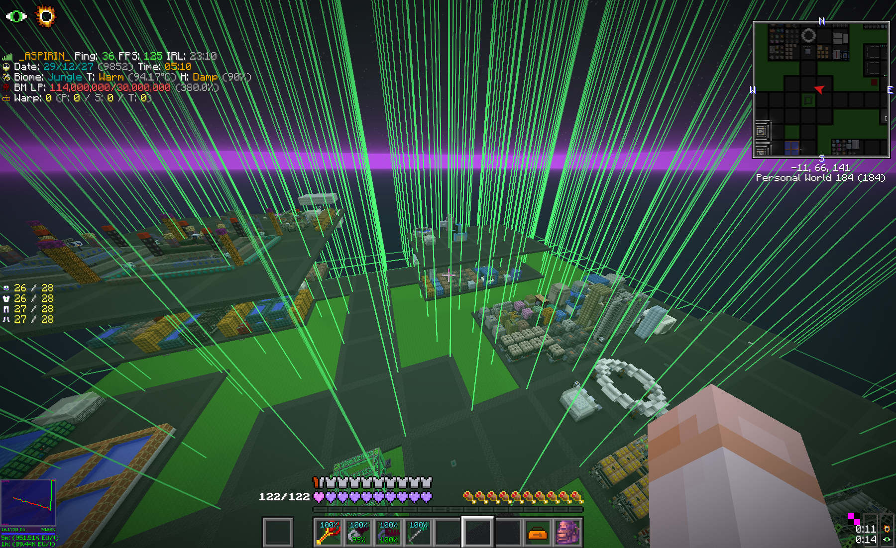
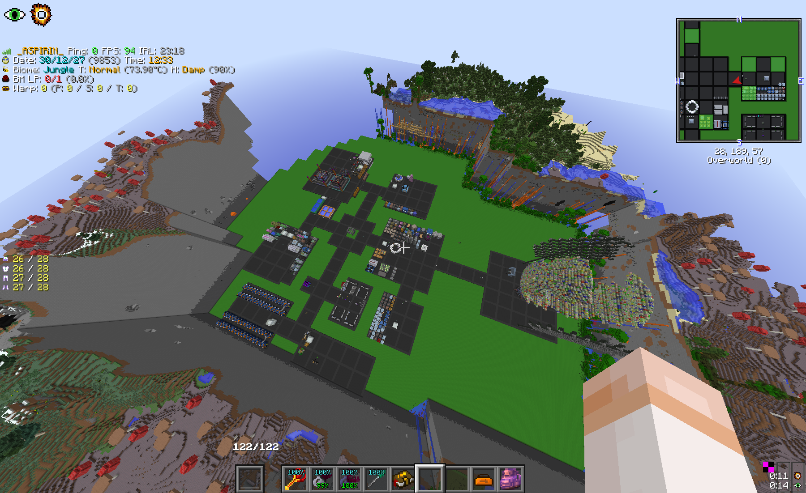

# DejaVu

DejaVu is a client-side GT New Horizons mod that archives chunks received from a multiplayer server into a local, singleplayer-compatible world.

It is useful for personal exploration archives and recovery references. It is **not** a server-backup tool.




## Features

- periodically captures chunks currently loaded around the player
- preserves block IDs, metadata, chunk sections, biome data, and serializable tile-entity state received by the client
- creates `level.dat` and a backup manifest so the result appears in the singleplayer world list
- exposes capture statistics and controls through `/backupgui`
- highlights archived chunks in the world
- hot-reloads most JSON configuration changes

## Requirements

- GT New Horizons 2.8 / Minecraft 1.7.10
- Forgelin
- [KNH Core](../../framework/) with the same version as DejaVu

DejaVu is client-side and does not need to be installed on the server.

## Installation and use

1. Place `knh-core-<version>.jar` and `dejavu-<version>.jar` in the instance's `mods/` directory.
2. Join a multiplayer world and explore normally.
3. Run `/backupgui` to inspect progress, force a capture pass, or toggle highlights.
4. Disconnect before opening the generated world from the singleplayer menu.

Command aliases: `/backupstatus`, `/observedbackup`, and `/obbackup`.

Backups are stored under:

```text
<instance>/saves/observed-<server-name>-<server-address>/
```

The exported save starts in the overworld and enables creative mode and commands to make inspection safer and easier.

## Configuration

DejaVu creates `<instance>/config/dejavu.json`:

```json
{
  "enabled": true,
  "autosaveIntervalSeconds": 15,
  "flushEverySavedChunks": 8,
  "maxChunkRadius": 0,
  "saveSingleplayer": false,
  "showHud": false,
  "saveNamePrefix": "observed-",
  "showChunkHighlights": true,
  "highlightOnlyTargetedChunk": false,
  "highlightRenderRadiusChunks": 12,
  "highlightFillAlpha": 0.08,
  "highlightOutlineAlpha": 0.65
}
```

`maxChunkRadius = 0` follows the current render distance. Most changes reload while the game is running; `saveNamePrefix` applies when the next backup session root is created.

Previously archived chunks are shown in blue and chunks captured during the current session in green. The targeted chunk uses a stronger fill and outline.

## Limitations

A Minecraft client only knows data the server sends to it. Consequently:

- unexplored or unloaded chunks are absent
- anti-xray substitutions are archived exactly as presented to the client
- server-only state is unavailable
- entities and some modded tile entities may be incomplete
- a partially observed world may not behave like the original server

Treat the output as an observed-world archive, not an authoritative or complete backup. Make a copy before opening an important archive with a different modpack version.

## Build

From the repository root:

```bash
./gradlew -p framework publishToMavenLocal
./gradlew -p mods/dejavu clean build
```

Artifact:

```text
mods/dejavu/build/libs/dejavu-<version>.jar
```
