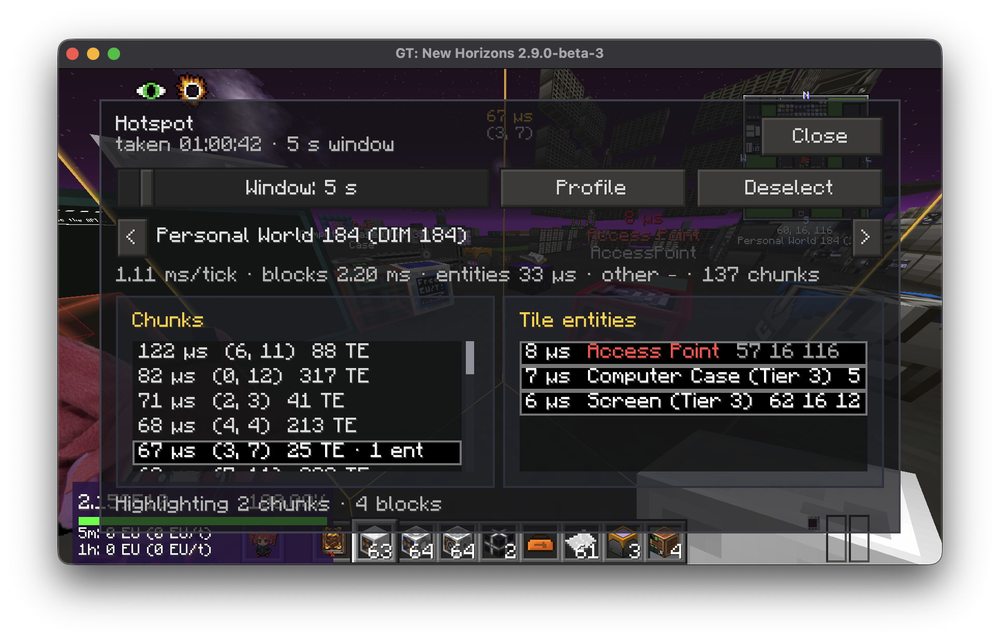
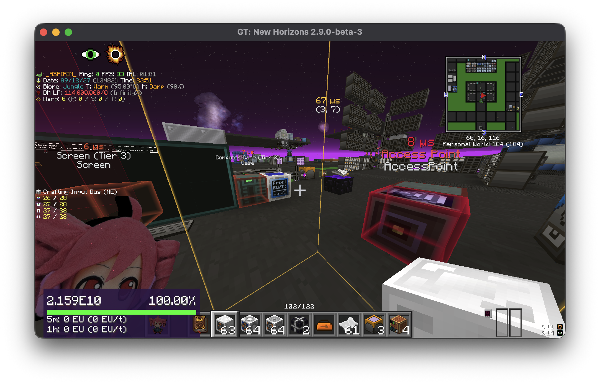

# Hotspot

Finds what eats server ticks and shows it in the world. Built for GT New Horizons (Minecraft 1.7.10), where lag is almost always tile entities: machines, pipes, cables.

Opis already measures every tile entity on the server; Hotspot is the in-game front end for that data. Profile for a few seconds, pick the heaviest chunks and the blocks inside them, and they get drawn right where they stand — a tinted column per chunk, a box per block, with the milliseconds on top. No external window, no teleporting, no op.




## What it does

- one button profiles the server for 1–60 s (the window is a slice, not a live stream)
- chunk list per dimension, heaviest first, with block and entity counts
- click a chunk: it is highlighted in the world and its tile entities are listed heaviest first
- multi-select tile entities (Ctrl/Cmd+click, Shift+click, Ctrl/Cmd+A) to box them in the world with their cost, name and class
- colours go green → red relative to the heaviest highlighted item
- entities are folded into chunk totals; block ticks and other per-world work show as "other"
- the last snapshot and your picks are saved per world/server (`config/hotspot/profiles/`) and come back next time you join
- picks survive a re-profile as long as the same blocks are still listed
- freecam-aware: the overlay follows the camera, not the player

## Install

Universal jar. Put `hotspot-<version>.jar` and the matching `knh-core-<version>.jar` in `mods/` on **both** client and server. The server also needs **Opis** (part of GTNH). Forgelin is part of the pack.

Versions of Hotspot and KNH Core must match.

## Who may profile

Not ops. The server decides through `config/hotspot-server.cfg`:

```
allowedPlayers = aspirin, friend        # names or UUIDs
allowEveryone = false
maxDurationSeconds = 15
minMicrosPerTileEntity = 5              # cheaper tile entities are counted, not listed
maxListedTileEntitiesPerChunk = 128
```

The file is re-read when edited, no restart needed. The singleplayer host is always allowed. Opening the menu asks the server first; if the mod is missing on the server, the player is not on the list, or Opis is absent, a small dialog says so instead of the menu.

## Use

`/hotspot` opens the menu (or bind **Open Hotspot menu** under Options → Controls → Hotspot; unbound by default).

1. Pick a window, press **Profile**. A line above the hotbar counts down; the menu can be closed meanwhile.
2. When the snapshot arrives the menu shows the dimension you are in — `<` `>` switch dimensions — with its tick time, how much of it is blocks, entities and other, and the chunk list.
3. Click a chunk. It gets a glass column in the world; the right pane lists its tile entities.
4. Select tile entities; they get glass boxes with `2.31 ms`, the machine name, and the class name.
5. **Deselect** drops every highlight; the snapshot stays. **Profile** again replaces it.

`/hotspot profile [seconds]` and `/hotspot deselect` do the same without the menu.

## Settings

**Mods → Hotspot → Config** or `config/hotspot.cfg` (client): default window, labels on/off, class names on/off, label distance, chunk column height.

## How it works

The server activates MobiusCore's profiler (the same ASM hooks Opis uses) for the requested number of ticks, reads the per-tile-entity and per-entity timings straight from the profiler objects, resolves names (GT machine name, else the block's item name, else the class), groups by chunk and streams the result to the client in pages under the 32 KiB packet limit. Nothing about the run goes through Opis' own commands or permission checks. Several players asking at once share one run.

## Build

```bash
./gradlew -p framework publishToMavenLocal
./gradlew -p mods/hotspot clean build
```

Jar: `mods/hotspot/build/libs/hotspot-<version>.jar`. See the [repository README](../../README.md) for the full build.
