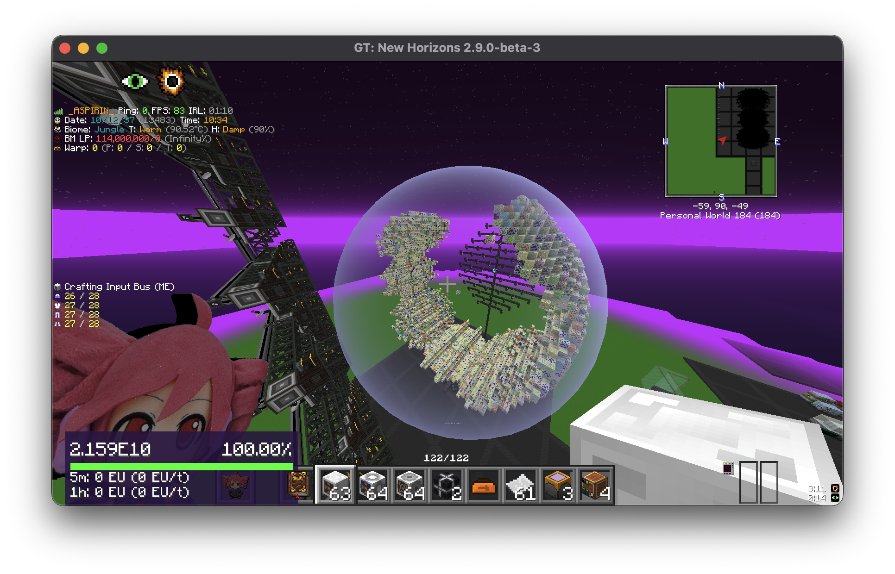
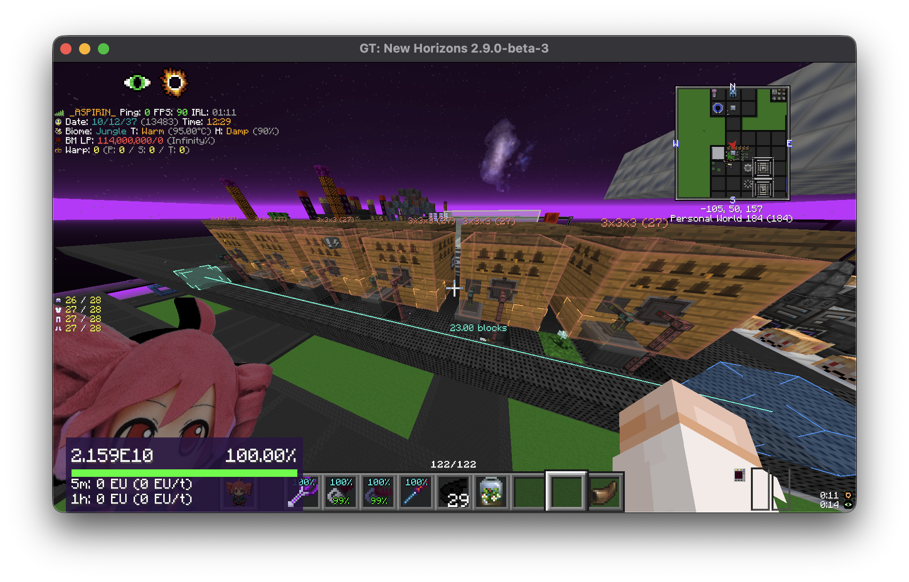

# Measure

Measure is a client-side measurement toolkit for GT New Horizons. It creates persistent line, area, and sphere selections and renders them as in-world overlays.




## Features

- line, area, and sphere measurement modes
- live placement previews and right-angle constraints
- single and multi-selection
- move and resize interactions
- copy, cut, paste, delete, undo, and redo
- separate persisted measurements for each singleplayer world or multiplayer server
- a Compose Runtime-based editor screen

## Requirements

- GT New Horizons 2.9.0-beta-3 / Minecraft 1.7.10
- Forgelin
- [KNH Core](../../framework/) with the same version as Measure

Measure is client-side and does not need to be installed on the server. Targeting and overlays follow the render view entity, so detached-camera mods such as [Freecam](https://github.com/GTNewHorizons/Freecam) work without any extra setup. When [Freecam](https://github.com/GTNewHorizons/Freecam) is installed and its camera is active, targeting reach starts at the configurable `freecamReach` (32 blocks by default) so anchors can be placed from the air; adjust it on the fly with Ctrl/Cmd + scroll (Shift for steps of 8). It resets to the default whenever freecam is turned on.

## Usage

Run `/measure` (or bind **Open measure menu** under Options → Controls → Measure; unbound by default) to open the editor: pick a mode, browse and select this dimension's measurements, delete, undo/redo, and see the shortcut reference. While a mode is active, aim at blocks (or at existing anchors, even in mid-air) and use the following controls:

| Action | Windows/Linux | macOS |
| --- | --- | --- |
| Create or place an anchor | Middle mouse button | Middle mouse button |
| Target the adjacent block face | Ctrl + middle mouse | Control + middle mouse |
| Select an existing measurement | Shift + middle mouse | Shift + middle mouse |
| Add to selection | Shift + Ctrl + middle mouse | Shift + Control + middle mouse |
| Move or resize | Alt + middle mouse | Option + middle mouse |
| Constrain placement to right angles | Hold Shift | Hold Shift |
| Copy / cut / paste | Ctrl+C / Ctrl+X / Ctrl+V | Command+C / Command+X / Command+V |
| Undo | Ctrl+Z | Command+Z |
| Redo | Ctrl+Y or Ctrl+Shift+Z | Command+Shift+Z |
| Delete selection | Delete or Backspace | Delete |
| Cancel current interaction | Escape | Escape |

The editor shows the active platform-specific shortcuts in its footer while a mode is selected, and an in-game hint box above the hotbar lists the actions available for the current selection.

## Settings

**Mods → Measure → Config** (or `<instance>/config/measure.cfg`): shortcut hint box on/off and its margin, macOS vs. standard shortcut scheme (auto-detected by default), and undo history size.

## Sharing measurement sets

`/measure export <name>` writes the current selection (or, with nothing selected, every measurement in the current dimension) to `<instance>/config/measure/exports/<name>.json`; `/measure import <name>` merges such a file into the current dimension (duplicates are skipped, the import is undoable) and leaves the imported measurements selected; `/measure exports` lists what is available. **Move** (menu button or `/measure move`) then picks the whole selection up as one batch — its lowest corner follows the crosshair, Shift constrains to one axis, the create click drops it. That is how a layout designed in a test world gets placed on a server: export, import, Move, aim, click. The same export/import row lives in the menu.

## Saved data

Measurements are saved as JSON files under:

```text
<instance>/config/measure/measurements/
```

File names are derived from the server address (or server name) or the singleplayer world name. Measurement data never needs to be installed on the server.

## Build

From the repository root:

```bash
./gradlew -p framework publishToMavenLocal
./gradlew -p mods/measure clean build
```

Artifact:

```text
mods/measure/build/libs/measure-<version>.jar
```
