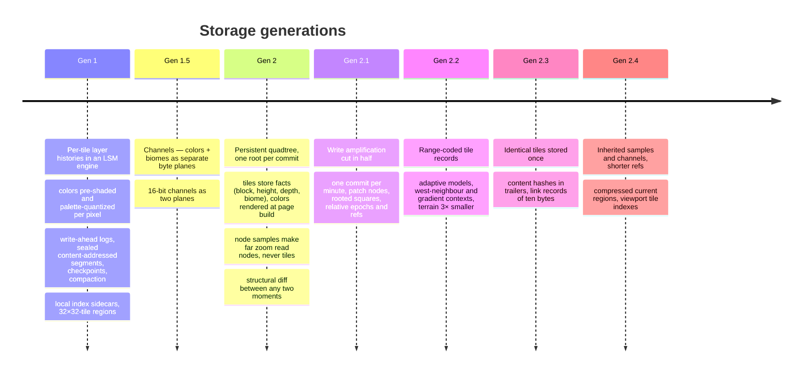
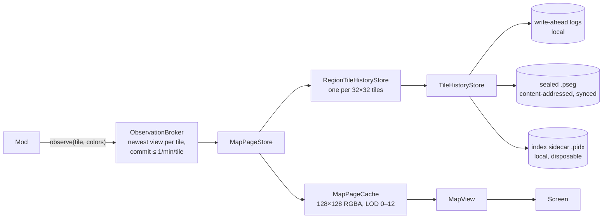
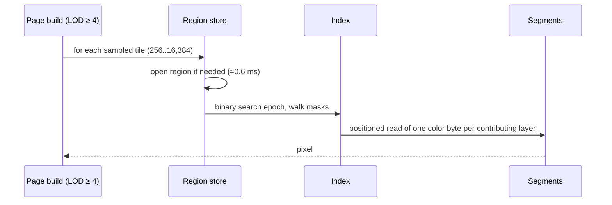
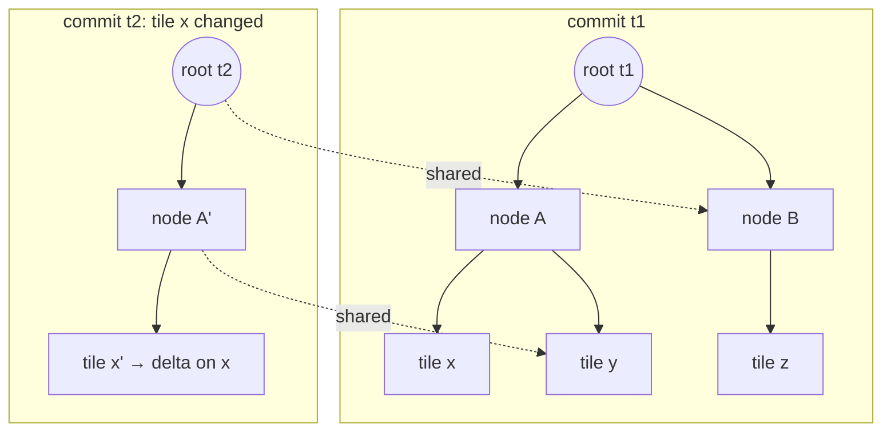
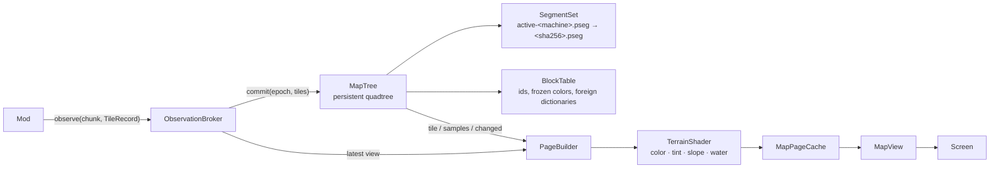
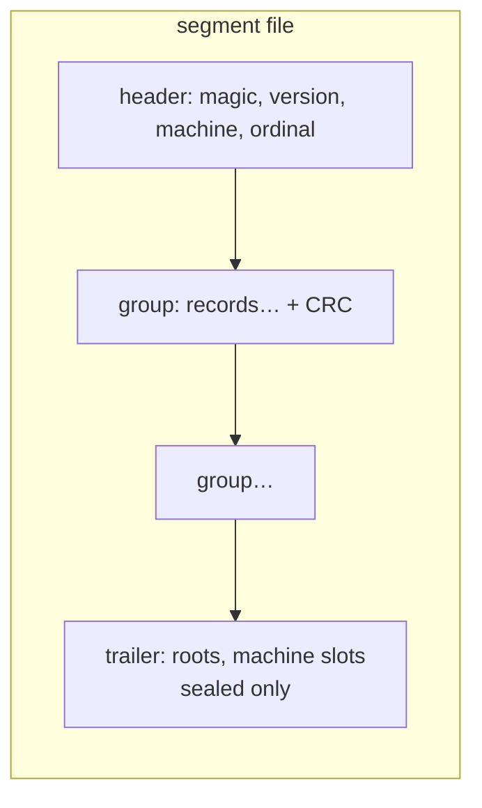
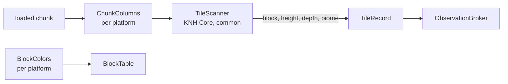

# Palimpsest storage architecture

Palimpsest keeps a **time-spatial history of a Minecraft map**: not just what every chunk looks
like now, but what it looked like at any moment since it was first seen, so a world with ten
thousand hours on it can be scrubbed like a video.

This document records how storage evolved, so the reasoning survives the code that carried it.
Generation 1 is described as it was; the generation 2 family runs today. Early figures come from
the headless suite (`./gradlew :palimpsest:storageSuite`) on a MacBook Pro (M4 Max, 36 GB, macOS,
JDK 26). Later entries identify their own workload and toolchain. These synthetic workloads stress
the engine rather than predict the size of a particular player's world.


```mermaid
timeline
    title Storage generations
    Gen 1 : Per-tile layer histories in an LSM engine
          : colors pre-shaded and palette-quantized per pixel
          : write-ahead logs, sealed content-addressed segments, checkpoints, compaction
          : local index sidecars, 32×32-tile regions
    Gen 1.5 : Channels — colors + biomes as separate byte planes
            : 16-bit channels as two planes
    Gen 2 : Persistent quadtree, one root per commit
          : tiles store facts (block, height, depth, biome), colors rendered at page build
          : node samples make far zoom read nodes, never tiles
          : structural diff between any two moments
    Gen 2.1 : Write amplification cut in half
            : one commit per minute, patch nodes, rooted squares, relative epochs and refs
    Gen 2.2 : Range-coded tile records
            : adaptive models, west-neighbour and gradient contexts, terrain 3× smaller
    Gen 2.3 : Identical tiles stored once
            : content hashes in trailers, link records of ten bytes
    Gen 2.4 : Inherited samples and channels, shorter refs
            : compressed current regions, viewport tile indexes
```

The goals never changed: look like the game, make time travel and time-lapse instant at any zoom,
read less data when zoomed out instead of summarizing, freeze colors on first sight so a resource
pack cannot rewrite history, and keep the whole thing in a git repository shared between machines.

---

## Generation 1 — per-tile layer histories (retired)

### The model

| Term | Meaning |
|---|---|
| **tile** | one chunk seen from above: 16×16 pixels, each one byte — a palette entry, pre-shaded |
| **layer** | one observation of a tile: an epoch, a 256-bit coverage mask, colors for the covered pixels |
| **history** | a tile's layers ordered by epoch |
| **region** | 32×32 tiles, one directory on disk, the unit of opening and syncing |
| **palette** | 256 colors derived once from the modpack's block textures by weighted median cut; a *tintable* band of greys for blocks the game colors per biome |

The map sent the whole current view of a tile and the store diffed it against the tile's latest
state: unchanged pixels were dropped, a layer with nothing changed was dropped entirely.
Reconstructing a tile at epoch *E* walked its layers newest-first from the last one at or before
*E* until every pixel was resolved. Event sourcing with per-pixel granularity.


```mermaid
flowchart LR
    Mod -- "observe(tile, colors)" --> Broker[ObservationBroker<br/>newest view per tile,<br/>commit ≤ 1/min/tile]
    Broker --> Store[MapPageStore]
    Store --> Regions[RegionTileHistoryStore<br/>one per 32×32 tiles]
    Regions --> Engine[TileHistoryStore]
    Engine --> WAL[(write-ahead logs<br/>local)]
    Engine --> Seg[(sealed .pseg<br/>content-addressed, synced)]
    Engine --> Idx[(index sidecar .pidx<br/>local, disposable)]
    Store --> Pages[MapPageCache<br/>128×128 RGBA, LOD 0–12]
    Pages --> View[MapView] --> Screen
```

### The engine

**Write path.** An append was normalized against the current tiles, encoded into a segment image
and written to the active write-ahead log — CRC-framed, sequence-numbered, not fsynced per append
(losing the last seconds after a crash only means those chunks are observed again). Only then did
the store take its lock, for microseconds, to publish index entries.

**Sealing.** Past 1 MiB or five minutes the log was frozen, appends switched to a second log, and
the frozen log became one content-addressed segment (`<sha256>.pseg`, fsync, atomic rename).

**Checkpoints.** A tile with 64 layers since its last full layer got its newest sealed layer
written as a full snapshot at the same epoch, so no read walked more than 64 records — the
I-frame / P-frame trick from video codecs, per tile.

**Compaction.** Eight sealed segments under 4 MiB were merged into one, size-tiered like an LSM
tree; the reader tolerated the same layer arriving from two machines' compactions and kept one
deterministically.

**Read path.** Binary search on the tile's epochs, then a newest-first walk with union coverage
masks per 64 layers to skip whole groups, per-layer masks to skip layers, and a span reader that
pulled a contiguous run of records in one positioned read. Sampled reads for zoomed-out pages
derived the byte offset of one pixel from the mask and read just that byte.

**The index.** 20 bytes per layer in primitive arrays (epoch, packed location, coverage
reference), cached in a checksummed sidecar keyed to the exact segment set, loaded per tile on
first touch, evicted LRU under a 16 MiB budget per region.


```mermaid
sequenceDiagram
    participant P as Page build (LOD ≥ 4)
    participant R as Region store
    participant I as Index
    participant S as Segments
    P->>R: for each sampled tile (256..16,384)
    R->>R: open region if needed (≈0.6 ms)
    R->>I: binary search epoch, walk masks
    I->>S: positioned read of one color byte per contributing layer
    S-->>P: pixel
```

### What it measured

| workload | result |
|---|---|
| 48-tile viewport, latest, warm | 35–36 µs after checkpoint (166–358 µs before) |
| 48-tile viewport, middle of history | 45–394 µs |
| 1 M single-pixel layers | 5.9 MB on disk (5.9 B/layer), 44 µs reads, 4.8 ms reopen |
| dense 512×512-tile world, one page cold | LOD 4 20–53 ms · LOD 6 240–380 ms · LOD ≥ 7 13–19 ms |
| giant world: hot base appends (800 layers) | p50 0.72 ms · p99 4.6 ms |
| giant world: whole-world page (LOD 7) cold | 157–162 ms, 259 regions opened |
| giant world: time-lapse step | 170 µs |

### Why it was retired

Two limits were baked into the data, not the code:

1. **The look was frozen in the pixels.** 231 palette entries for every GTNH block and the vanilla
   map's dim shading were applied *before* storage. Machines collapsed to the same grey, water
   snapped to one blue, and no rendering improvement could ever reach old history.
2. **Every zoom level and every moment was a per-tile walk.** A far-zoom page opened one region per
   sampled tile; a historical page replayed each tile's layers; "what changed between Monday and
   Friday" meant comparing everything. The index made each step fast, but the number of steps was
   the world size, not the screen size.

A **channel** step in between (colors and biomes as separate byte planes; a 16-bit channel as two
planes) fixed EndlessIDs' 65,536 biome ids but not either limit, and made clear that the store
should hold *facts* and let the renderer decide the look.

---

## Generation 2 — a persistent quadtree (current)

### The model

| Term | Meaning |
|---|---|
| **tile** | one chunk seen from above: 16×16 cells of facts — block id, height, liquid depth, biome |
| **height** | one byte, 0–255; worlds that reach below 0 or above 255 (26.2 spans −64..319) flatten to those ends |
| **block id** | index into a machine's vocabulary `blocks.<machine>.tsv`, which froze the block's color and tint flag on first sight |
| **biome** | 16 bits: the registry id on GTNH (EndlessIDs goes past 255), a hash of the biome key on 26.2, where registry ids differ between packs |
| **tile record** | one version of a tile: full (every cell) or a delta against the previous version |
| **node** | a square of the quadtree at level *k* (2^k tiles per side): four child refs, one sample per child, the newest epoch below |
| **sample** | one cell's facts standing for a subtree: its first present quarter's sample, recursively down to the tile's centre cell |
| **root** | the level-22 node of one commit, stamped with the commit epoch; the list of roots is the history |
| **ref** | where a record lives: segment and offset |
| **segment** | an append-only file of records; sealed at 4 MiB, renamed to its SHA-256, listed in the machine's manifest |
| **slice** | one directory of segments: the map looked down from one ceiling — the top of the dimension is the surface, `y255/` on GTNH and `y319/` in a 26.2 overworld |

The broker is unchanged: newest view per tile, commit at most once per tile per minute. A commit
is one [MapTree.commit](src/commonMain/kotlin/io/github/fopwoc/mods/palimpsest/tree/MapTree.kt): every
changed tile gets a record, every node on the path from it to the root gets a copy with the new
child, everything else is shared with the previous root by reference — git's tree objects over
pixels.


```mermaid
flowchart TB
    subgraph commit t1
        R1((root t1)) --> A1[node A] --> T1[tile x]
        A1 --> T2[tile y]
        R1 --> B[node B] --> T3[tile z]
    end
    subgraph commit t2: tile x changed
        R2((root t2)) --> A2[node A']
        A2 --> T1b[tile x' → delta on x]
        A2 -. shared .-> T2
        R2 -. shared .-> B
    end
```

Everything below follows from that shape:

- **Reading the map at a moment** is a binary search in the root list, then a descent. Nothing is
  replayed; an old root is a complete map.
- **Zooming out reads nodes, not tiles.** A page pixel at LOD *L ≥ 4* is a level *L−4* square and
  its facts are the sample its parent keeps for it; a 128×128 page is 4,095 parent nodes whatever
  the world size. Below LOD 4 a page decodes the tiles it shows.
- **What changed between two moments** is a parallel descent of two roots that stops wherever the
  child refs are equal. Cost is proportional to the changed area, not to the world or to the
  history. The historical page cache uses it to drop only the pages that differ when the slider
  moves.
- **Unchanged tiles cost nothing.** A tile whose facts equal its current version is skipped; a
  commit that changes nothing writes a root and nothing else.

Two conscious departures from generation 1's principles: node samples are derived data that *is*
persisted and synced — deterministic copies of one cell, never summaries — and each commit is one
root, so time resolution is the broker's cadence, which was already the promise.

### The stack


```mermaid
flowchart LR
    Mod -- "observe(chunk, TileRecord)" --> Broker[ObservationBroker]
    Broker -- "commit(epoch, tiles)" --> Tree[MapTree<br/>persistent quadtree]
    Tree --> Segs[SegmentSet<br/>active-&lt;machine&gt;.pseg → &lt;sha256&gt;.pseg]
    Tree --> Blocks[BlockTable<br/>ids, frozen colors, foreign dictionaries]
    Broker -- latest view --> Builder
    Tree -- "tile / samples / changed" --> Builder[PageBuilder]
    Builder --> Shader[TerrainShader<br/>color · tint · slope · water]
    Shader --> Cache[MapPageCache] --> View[MapView] --> Screen
```

### Tile records — cost follows change

[TileCodec](src/commonMain/kotlin/io/github/fopwoc/mods/palimpsest/tree/TileCodec.kt) writes each of the
four channels through [ChannelCodec](src/commonMain/kotlin/io/github/fopwoc/mods/palimpsest/tree/ChannelCodec.kt),
which picks the smallest of: one value for the grid; a local palette with indices packed at
`ceil(log2 n)` bits; for full grids, residuals against the median-edge predictor of the west,
north and north-west neighbours (LOCO-I / JPEG-LS), packed at the width the largest residual
needs — heights are smooth, so mostly 0 and ±1; or raw. A delta record carries only the cells
that differ from its base through the same coder; a full record is forced after 16 deltas.

Each of those shapes also has a **range-coded** twin: the same indices or residuals through an
adaptive arithmetic coder (the LZMA-style range coder with per-context frequency models that
adapt identically on both sides, so nothing is stored but the bytes). Palette indices are
conditioned on the western neighbour's index; height residuals on how rough the already-decoded
neighbourhood is (four gradient contexts, an escape for the rare large jump). The encoder tries
every applicable shape and keeps the smallest, so a record never gets bigger for it.

| tile shape | bit-packed | range-coded (current) |
|---|---|---|
| uniform | 30 | 28 |
| near-uniform (one odd cell) | 65 | 38 |
| terrain bands (four block rows, height steps) | 161 | 49 |
| hills (three blocks, two biomes, rolling heights) | 196 | 67 |
| varied (noise in block and height) | 574 | 313 |

Bytes per tile include the tile's share of nodes. Plain encoding is 1,536 bytes per tile. On the
dense 512×512-tile world this took the segments from 113 MB to 38 MB, and the giant world's cold
generation from 187 MB to 54 MB; the edit histories, which are mostly nodes and tiny deltas,
barely moved. Encoding got slower — the four candidates are all built — commit p50 50 → 60 µs.

### Identical tiles are stored once

Every full record's facts are hashed (64 bits, epoch excluded) into a content index kept in a
primitive map in memory and written into each sealed segment's trailer. A tile whose facts match
a record already on disk — an ocean chunk, a desert, a farm restored to how it was — is written
as a **link**: its epoch, its previous version and the target, about ten bytes. The link is
preferred over a delta and a full record alike, and the target's facts are compared, not just the
hash, before linking. The synthetic worlds repeat their patterns, so they overstate it (the
512×512 world went from 38 MB to 17 MB, the giant world's cold generation from 54 MB to 32 MB);
in a real world the win is the water and the plains, which is most of the map. Commit p50 60 →
82 µs for the hash and the lookup.

### Segments — immutable, hashed, per machine


```mermaid
flowchart LR
    subgraph segment file
        H[header: magic, version, machine, ordinal] --> G1[group: records… + CRC] --> G2[group…] --> T[trailer: roots, machine slots<br/>sealed only]
    end
```

[SegmentWriter](src/commonMain/kotlin/io/github/fopwoc/mods/palimpsest/tree/SegmentWriter.kt) stages a
commit's records into one CRC-framed group and appends it in a single write; readers on other
threads see a group entirely or not at all, and the whole active segment stays in memory so fresh
records never touch the disk. A torn tail is truncated on the next open. Sealing writes the
trailer, fsyncs, renames the file to its content hash and appends the name to
`segments.<machine>.txt`. Refs inside a file name other segments by *machine slot* and ordinal,
so a segment written after a git sync can point into another machine's files. Sealed segments are
memory-mapped on first use.

### Where the facts come from

The capture side is the only part that knows which game it runs in. Everything else above,
`MapTree` to `MapView`, is shared by GTNH 1.7.10, Fabric 26.2 and NeoForge 26.2.


```mermaid
flowchart LR
    Chunk[loaded chunk] --> Columns[ChunkColumns<br/>per platform]
    Columns --> Scanner[TileScanner<br/>KNH Core, common]
    Colors[BlockColors<br/>per platform] --> Vocab[BlockTable]
    Scanner -- "block, height, depth, biome" --> Record[TileRecord] --> Broker[ObservationBroker]
```

A platform scanner walks the loaded chunks around the player a few per tick, in a fixed spiral,
so every chunk in render distance is observed about every two seconds. `TileScanner` turns one
chunk into facts per column, looking down from the slice's ceiling: the first block the map does
not look through, its height, the depth of the water above it, and the biome. Water is looked
through to the floor. A *decoration* (a plant, a slab, a machine part: anything that isn't a full
cube) is the block but keeps the height of what it stands on, so a meadow doesn't shade like a
rockslide. Circuitry (torches, levers, redstone, rails) is see-through.

`BlockColors` gives each block its colour the first time the vocabulary sees it. Both platforms
average the block's top texture in linear light over its opaque texels, through KNH Core's shared
`TexelAverage`, and classify it as tinted by grass, by foliage or not at all. The texture comes
from where each game keeps it:

- **GTNH** asks the block for its icon at the position, which is how GregTech machines report
  their real texture from the tile entity, and decodes it from the resource manager. The
  vocabulary key is the block's name plus its dropped metadata, or a provider's stable identity:
  GregTech machines are keyed by what they are, not by metadata that also encodes transient
  state. Readiness providers hold back chunks whose tile-entity data hasn't arrived yet, since a
  chunk packet precedes its tile entities and a half-loaded GregTech machine stack would
  otherwise become history (AE2 blocks are guarded the same way).
- **26.2** reads the top-facing quads of the block state's baked model and decodes their
  textures; liquids use their still texture. A tint source whose colour differs between the
  block's default and its position is the biome's and is left to the shader; a constant one
  (spruce leaves) is baked in. The vocabulary key is the block's registry name: the flattening
  gave every material variant its own block, so the name is the identity. Biome tints are built
  from the level's biome registry and indexed by the same key hash the tiles store.

### Rendering — facts to pixels at page build

[PageBuilder](src/commonMain/kotlin/io/github/fopwoc/mods/palimpsest/render/PageBuilder.kt) fills a
129×129 grid of facts (a border row and column so slopes at the page edge see their neighbours)
from tiles or node samples, overlaying what the broker holds but hasn't committed yet;
[TerrainShader](src/commonMain/kotlin/io/github/fopwoc/mods/palimpsest/render/TerrainShader.kt)
turns it into RGBA: the block's frozen color, the biome tint where the block takes one, a
hillshade lit from the north-west against the western and northern neighbours (clamped, with a
checkerboard dither so one-block steps don't band), and water laid over the floor by depth,
see-through in the shallows and darker as it deepens. Every rule lives in the shader and none in
the history, so a better look repaints the past too.

### Why git can still be the replication protocol

Only sealed `.pseg` files, manifests and vocabularies are data; the active file and the machine id
are `.gitignore`d by the store itself. Segments are immutable and named by content, and each
machine writes only its own segment files, manifest and vocabulary, so a merge is a union of
files with no conflicts. Reading a map that holds two machines' root chains (overlaying their
trees, newest subtree wins) is the one piece not yet written.

### What it measured, against generation 1

**Reads, where the tree wins.** The 48-tile viewport read 120 times, warm; "historical" is the
middle of the history.

| case | versions | gen 1 latest | gen 1 historical | gen 2 latest | gen 2 historical |
|---|---|---|---|---|---|
| sparse (8 cells / edit) | 33,024 | 36 µs | 232 µs | **75 µs** | **80 µs** |
| mixed (rectangles, scatter, full) | 33,024 | 35 µs | 328 µs | **26 µs** | **24 µs** |
| adversarial (1 cell / edit) | 33,024 | 35 µs | 45 µs | **12 µs** | **11 µs** |
| adversarial, 1 M versions | 1,001,024 | 44 µs | 85 µs | **14 µs** | **13 µs** |

A historical read costs the same as a live one because there is nothing to replay.

A page of a dense 512×512-tile world, cold in the same process, and from a fresh process:

| LOD | tiles under the page | gen 1 cold | gen 2 cold | gen 2 fresh process |
|---|---|---|---|---|
| 4 | 16,384 | 27–53 ms | **10.7 ms** | 13 ms |
| 5 | 65,536 | 58–114 ms | **6.7 ms** | 8.6 ms |
| 6 | 262,144 | 239–383 ms | **3.7 ms** | 10.7 ms |
| 7 | 1 M | 15–93 ms | **1.8 ms** | 9.1 ms |
| 8–12 | 4 M – 1 G | 13–39 ms | **1.2–1.8 ms** | 7.5–8.3 ms |

Giant world (1024×1024 tiles, an 8×8-tile base with 50,000 commits, reader and sealer alongside):

| | gen 1 | gen 2 |
|---|---|---|
| cold generation | 3.1 M layers in 27 s, 298 MB | 1.1 M records in 12 s, 193 MB |
| hot base commits | 100 epochs per append, p50 0.72 ms | one commit p50 **50 µs**, p99 130 µs |
| reader rebuilding the base page during writes | p50 0.42 ms | p50 **0.26 ms** |
| fresh process: open + base page | 11.6 ms | **0.5 ms** |
| base viewport (64 tiles), warm | 55 µs | **18 µs** |
| whole-world page (LOD 7), cold | 157 ms, 259 regions | **1.4 ms**, 5,436 nodes |
| time-lapse step, whole world | 169 µs | 320 µs |
| time-lapse step, base page | ~1 µs | 2.5 ms (64 tiles re-decoded) |

**Writes, where the tree pays.** Path copying costs about one node per level per changed
cluster. In the synthetic histories every commit changes 16 scattered tiles of a 32×32 world.
The first cut of the tree rewrote ~62 full nodes per commit (≈2.8 KB) on top of ~16 small
deltas; four changes then attacked that directly:

1. **One commit per interval, globally.** The broker used to commit each tile a minute after its
   last commit, so a tick could produce a root for whatever happened to be due — up to 60 roots a
   minute while exploring. Now every changed tile goes into one commit per minute, and far-zoom
   pages overlay the broker's uncommitted tiles so a new chunk still shows at once.
2. **Patch nodes.** A node that differs from its predecessor in one or two quarters is written
   as "that node, but these quarters" (~21 bytes instead of ~45); a full node is forced after
   eight patches so a cold read never follows a longer chain. 82 % of the nodes a commit writes
   are patches.
3. **Rooted squares.** The root names the smallest square holding everything seen, so the
   ~17 single-child levels above an explored world are not written at all; the tree grows a level
   only when an observation lands outside.
4. **Relative epochs and refs.** Epochs are deltas from the segment's base epoch (2 bytes, not 6);
   a ref into the segment being written costs one byte plus its offset.

| case | gen 1 on disk | gen 2, full nodes | gen 2, patch nodes | nodes per commit |
|---|---|---|---|---|
| sparse, 2,000 commits | 888 KB | 7.2 MB | **4.4 MB** | 45, 37 of them patches |
| mixed, 2,000 commits | 5.8 MB | 15.9 MB | **13.1 MB** | 45 |
| adversarial, 2,000 commits | 440 KB | 6.4 MB | **3.6 MB** | 45 |
| adversarial, 62,500 commits | 5.9 MB | 203 MB | **114 MB** | 45 |
| giant world hot base, 50,000 commits | ~8 MB | 129 MB | **74 MB** | 37, 32 of them patches |

What is left is a floor of about 1.8 KB per commit of 16 scattered tiles: ~60 records, each
paying its framing, a sample and a ref. It is per *commit*, not per tile, and in play a commit is
a minute of clustered changes, so a day of continuous building is ~1,440 commits of a few KB —
single-digit MB. The current unchanged-fact check skips idle periods without writing a root. History thinning (keeping hourly roots
after a month) would bound the long run if it ever matters.

Reopen is the root list: 2–4 ms for 2,000 roots, 26 ms for 62,500.

### Generation 2.4 — compact metadata and indexed current regions

The byte-level audit separated tile payloads from tree metadata. Eleven real local maps showed
that compression was already effective for terrain: full GTNH overworld tiles averaged roughly
170 bytes versus 1,536 raw bytes. Editing-heavy histories were different. Nodes occupied 68% of
one NeoForge map, and 97% of the samples in its node patches repeated the base's sample. This
motivated shrinking metadata while retaining the existing lookup and chain bounds.

**Segment format 4.** The header version is bumped; earlier segment versions are rejected before
record decoding. This is an unreleased WIP with a clean-rebuild workflow, so no migration or old
format reader is added.

- A patch stores one byte containing four changed-quarter bits and four changed-sample bits.
  It writes references for changed quarters and samples only when those samples actually changed.
  Missing samples are inherited from the base that a patch already needs to decode. Removing a
  child clears its sample without serializing a fake sample. The eight-patch limit is retained.
- Local references may store a backward distance from their containing record. Older, distant
  references can retain absolute offsets. Cross-segment refs still identify machine slot and
  ordinal. Machine slots are declared before choosing the record's origin, so declarations cannot
  shift that origin halfway through encoding. The representation byte is 0 for null, 1 for an
  absolute local offset, 2 for a backward distance, and slot+3 for another segment.
- Tile deltas carry a four-bit changed-channel mask. Channels omitted from a delta inherit the
  base's values at those pixels. Encoded block IDs are translated once; inherited values are
  already in the reader's vocabulary. The sixteen-delta limit is retained.
- Whole-tile or uniform changes can select a full record when that is smaller after accounting for the
  full record's content-index entry. Whole-tile candidates reuse encoded channels; partial noisy changes avoid speculative full encoding. Checkpoints
  remain **one chunk each**; no full map image is ever serialized.

**Current region format 2.** The history-disabled current layer formerly replaced one raw
1,564-byte file per chunk. On this APFS installation, a 1,024-tile fixture used 1.6 MB logically
and 4 MB of allocated blocks. Current tiles now share compressed 32×32 regions (`.preg`), with
an in-memory slot index pointing directly to each latest record. A tile read needs no tree walk
or history replay. Record metadata keeps machine, epoch and representative sample, so the
coarse sample pyramid can be rebuilt without decoding pixel channels.

Writes batch changes by region into checksummed append groups and force each changed region
once. A group publishes index entries only after its write is durable; reopening discards a torn
last group. Each tile payload also has its own checksum for random-access reads. Superseded
records trigger compaction at roughly twice the live record size, with a 4 KiB floor. Compaction
copies encoded records without re-encoding, forces a temporary replacement and atomically renames
it under the region's write lock. Readers cannot pair an old offset with a new file. Old `.tile`
files are rejected rather than silently hidden. Different regions of a commit remain independent,
as individual tile replacements were before; this is not a new cross-region transaction promise.

**Viewport index experiment.** A historical root is already an index of tile versions, not a
snapshot of all pixels. The extra index now resolves a bounded viewport of tile-version addresses
in one shared traversal and caches those addresses by immutable root and window. Page construction
uses the resolved window instead of starting a root-to-tile lookup for every chunk. The cache holds
at most 32 windows, stores no pixels, and adds **zero persisted bytes**. A cold window still walks
the tree once; reading an addressed tile still honors its bounded delta chain. This is an index
acceleration layer, not an assertion that all history reconstruction has disappeared.

The index stays at tile granularity. A naive four-byte pointer for each of a chunk's 256 pixels
would itself cost 1,024 bytes before storing any facts—several times typical compressed terrain.
Persisting a dense tile-address array for every world-wide root would also duplicate many unchanged
addresses. Those alternatives need a new structural-sharing design before they can beat the current
tree. The bounded window cache tests the useful part of the idea without paying that disk cost.

The benchmarks below compare the pre-change implementation with the final format. Earlier
generation tables retain their original toolchain and workload context.

#### Benchmarks for generation 2.4

Comparison against `205fcb03`, before these changes, using the same Kotlin compiler and Compose
plugin, JVM target 21, JDK 25, 1 GiB heap, and this Mac's APFS filesystem. The fixture starts with
1,024 tiles and adds 2,000 commits of 16 edited tiles each. Each process runs four rounds; the
first is warmup and the table reports medians of the following three. Segment sizes include the
empty active-file header after sealing. These synthetic fixtures measure storage behavior; they
are not a forecast of a particular player's map growth.

| Workload | Before bytes | After bytes | Reduction | Generate before → after |
|---|---:|---:|---:|---:|
| Eight scattered pixels per tile | 4,413,942 | 3,208,592 | 27.3% | 345.6 → 333.1 ms |
| Rectangles, scatter and whole tiles | 13,527,190 | 12,390,976 | 8.4% | 1167.8 → 1072.3 ms |
| One pixel per tile | 3,270,026 | 2,080,456 | 36.4% | 246.3 → 216.8 ms |

Reads below fetch 64 tiles at a historical epoch with decoded caches warm. The after column uses
the resolved tile-window index. A separate 500-commit test repeatedly edits one pixel of one tile;
its commit distributions include record encoding and publication, but not sealing.

| Workload | Warm read p50 before → after | Warm read p99 before → after | Single-tile commit p50 before → after | Single-tile commit p99 before → after |
|---|---:|---:|---:|---:|
| Sparse | 4.79 → 0.79 µs | 9.25 → 2.12 µs | 7.42 → 7.21 µs | 24.88 → 26.54 µs |
| Mixed | 4.88 → 0.67 µs | 6.58 → 2.00 µs | 7.58 → 7.33 µs | 44.71 → 42.92 µs |
| One-cell | 4.79 → 0.67 µs | 9.17 → 2.08 µs | 7.21 → 7.25 µs | 22.42 → 15.92 µs |

A cold decoded-cache test reopens the store for each sample, warms the JVM with 50 opens, then
measures 40 more. The OS file cache remains warm. Both versions read identical facts; checksums of
the returned pixels match. These are storage-window timings, not full page shading or frame times.

| Workload | Reopen p50 before → after | Cold historical read p50 before → after | Cold historical read p99 before → after |
|---|---:|---:|---:|
| Sparse | 1.224 → 1.214 ms | 0.626 → 0.568 ms | 0.821 → 0.699 ms |
| Mixed | 1.421 → 1.427 ms | 0.810 → 0.652 ms | 0.944 → 0.861 ms |
| One-cell | 0.878 → 0.936 ms | 0.233 → 0.234 ms | 0.371 → 0.357 ms |

The latest-only fixture writes 1,024 terrain tiles, then replaces one tile 180 times. Across three
runs, it used **1,601,536 → 91,148 logical bytes**, **4,194,304 → 94,208 allocated bytes**, and
**1,024 → 1 files**. Its initial durable write was **4,815 → 23 ms** at the median, because the new
store forces the region once instead of forcing every individual tile. Warm 64-tile reads were
**1.170 → 0.919 ms** at p50, and single-tile durable updates were **4.98 → 4.01 ms** at p50. The
terrain shapes repeat; this fixture demonstrates allocation and write batching, not universal
terrain compression ratios. Compaction is additionally exercised by the behavioral tests.

The first candidate encoded both full and delta forms for every dense edit. That reduced size but
made mixed generation **1,168 → 2,454 ms**, so it was rejected. The final encoder reuses whole-tile
channel bytes and only tries cheap uniform candidates for partial edits. This retained the measured
size savings and brought mixed generation down to **1,072 ms**. It deliberately does not promise
that every partial noisy edit chooses the globally smallest possible record.

To reproduce the **index-only** experiment on one current-format database, run:

```sh
./gradlew :palimpsest:tileIndexExperiment
```

It creates isolated temporary fixtures, verifies that individual and indexed reads return identical
tile versions, reports warm and decoded-cache-cold p50/p99, then deletes those fixtures. The index
adds no on-disk bytes. It keeps only tile addresses, while full checkpoints remain per chunk. Warm
fetch improvements do not imply the same multiplier for full rendered frames. Short tail-latency
runs showed GC/JIT outliers; the distributions above are measurements, not a hard latency bound.

#### Large spatial workloads for generation 2.4

Run the complete headless matrix with `./gradlew :palimpsest:storageSuite`. Three separate
process runs of `edc03a4d` passed all cases, including historical pixel checksums, reopen checks,
unchanged commits writing zero bytes, and concurrent reader/sealer checks. The benchmark JVM used
the project's JDK 26.0.2.1 toolchain, a 9 GiB maximum heap, and APFS on this 14-core Mac. Times
below are medians across those three runs; percentile rows are medians of each run's percentile.
These are absolute current-format measurements, not a large-world before/after comparison.

| Workload | Dense area in blocks | Mapped columns in dense area | History segment bytes | Generation |
|---|---:|---:|---:|---:|
| Wide world | 8,192 × 8,192 | 67,108,864 | 14,427,407 (13.76 MiB) | 2.12 s |
| Giant world, initial mapping and two revisits | 16,384 × 16,384 | 268,435,456 | 26,753,486 (25.51 MiB) | 6.79 s |
| Giant world, after 50,000 hot-area commits | same | same | 83,297,499 (79.44 MiB) | additional 16.25 s |

The wide case also observes 73,728 distant chunks: 335,872 observed chunks in total, representing
85,983,232 columns. Zoomed-out page footprints can include large unobserved gaps; they are not
additional stored terrain. The giant case initially observes 1,048,576 chunks, revisits each
32 × 32-chunk area twice with sparse edits, then edits eight chunks per commit within a 64-chunk
base. Its hot phase includes deliberate 20 ms pauses every 100 commits to let sealing interleave.
The hot generation time therefore includes at least 10 seconds of pacing.

| Giant-world operation | p50 | p99 |
|---|---:|---:|
| Commit during concurrent reads and sealing, 50,000 samples/run | 59 µs | 193 µs |
| Invalidated base-page rebuild during writes, 121,888–124,479 samples/run | 126 µs | 164 µs |
| Segment sealing, 12–13 samples/run | 8.60 ms | 11.46 ms |
| Warm latest 64-chunk viewport fetch, 50 samples/run | 10 µs | 17 µs |

The worst observed commit was 13.13 ms and page rebuild was 7.61 ms. The first base-page build
after reopening measured 0.488 ms; this timer starts after store construction and excludes reopen
itself. Building a page covering the entire giant world at LOD 7 measured 1.185 ms and decoded
6,422 node records. Ten historical whole-world steps also passed; nine steps after the first
measured 0.515 ms median, with a worst step of 3.67 ms across runs. Those nine-sample tails are
descriptive, not reliable p99 estimates.

| Wide-world page LOD | Columns in page footprint | First build | Fresh open + build + close | Node records decoded |
|---|---:|---:|---:|---:|
| 4 | 4,194,304 | 9.95 ms | 6.88 ms | 5,525 |
| 5 | 16,777,216 | 7.01 ms | 6.99 ms | 4,149 |
| 6 | 67,108,864 | 2.59 ms | 6.98 ms | 4,311 |
| 7 | 268,435,456 | 2.34 ms | 6.63 ms | 5,421 |
| 12 | 274,877,906,944 | 4.60 ms | 8.91 ms | 12,766 |

These first builds share a store while zoom levels progress, so earlier levels can warm node
caches. Fresh opens clear decoded caches but do not clear the OS filesystem cache. Coarse pages
decode no full tiles; they use node samples. Repeated page requests return the cached raster in
roughly 1–8 µs, which measures a cache hit rather than rendering. This is headless CPU page
generation; it excludes game-frame scheduling and GPU uploads.

The terrain uses deterministic repeating block patterns with fixed height, depth and biome,
deliberately exercising content reuse. The giant initial mapping links 1,048,320 tiles rather
than writing their facts again. These compact sizes must not be extrapolated to unique noisy
terrain or multiple independently changing height slices. The earlier mixed and varied fixtures
cover different entropy, but a large captured-world benchmark remains useful.

The source-set behavioral tests use a 128 × 128-chunk wide dense area (4,194,304 columns, plus
distant samples) and a 64 × 64-chunk giant area (1,048,576 columns) with 200 hot commits. The
ordinary history fixtures occupy only 32 × 32 chunks, or 262,144 columns. In particular,
`adversarial-1m` means 1,001,024 tile versions across 62,501 commits in that small area; it used
63,906,626 segment bytes. Version count and spatial coverage are separate dimensions.

### Where the ideas come from

- Path-copying persistent trees, structural sharing, "a commit is a root": **git**, Clojure's
  persistent vectors, Datomic, ZFS/Btrfs copy-on-write.
- Samples in internal nodes so a coarse view reads coarse nodes: **mipmaps**, quadtree LOD in
  terrain engines.
- Per-record adaptive shapes and the median-edge predictor: **JPEG-LS / LOCO-I**, PNG filters.
- Append-only CRC-framed groups, immutable content-addressed files, merge by union: **LSM trees**,
  git, Perkeep — inherited from generation 1.

### Guarantees and limits

- **Durability:** sealed segments are fsynced; the active segment is written per commit but not
  fsynced, so a crash can lose the last commits, which are observed again. A torn tail is
  truncated on open.
- **Integrity:** segment names are their SHA-256; structural damage surfaces as
  `CorruptTreeException` from the record that found it.
- **Concurrency:** one commit at a time (the game thread); reads run in parallel on IO workers
  against immutable records and a published-length snapshot of the active segment. One process
  writes a machine's segments: an open slice holds a lock on `active-<machine>.lock`, so a second
  game on the same installation and world fails to open the map instead of interleaving writes.
- **Vocabulary first:** the block vocabulary is saved before each commit, so no committed record
  names a block id the saved vocabulary lacks.
- **Bounds:** ≤ 16 deltas per tile decode and ≤ 8 patches per node decode; tile lookups descend
  one logical node per root level, with a 64k-node LRU. Physical reads also include patch bases.
  Coarse pages request a fixed 129 × 129 sample grid, but node decoding varies with ancestors,
  patch chains and cache reuse: the large spatial suite measured 4,149–12,766 records per page.
  Block ids are 16-bit per machine vocabulary.
- **Not done:** packed Morton-ordered snapshots for sequential cold reads, multi-machine overlay reads, history
  thinning.
