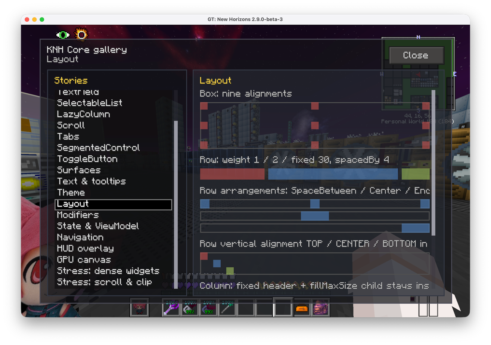
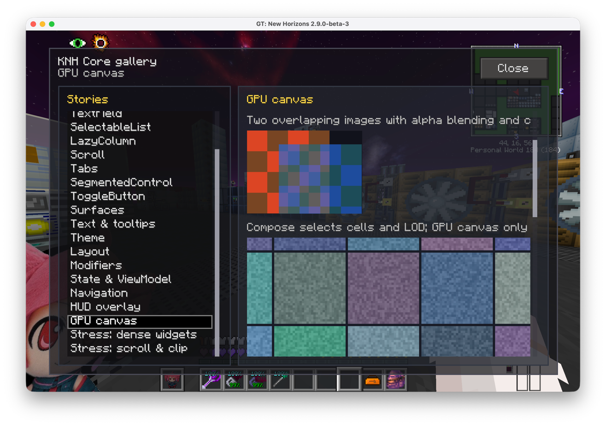
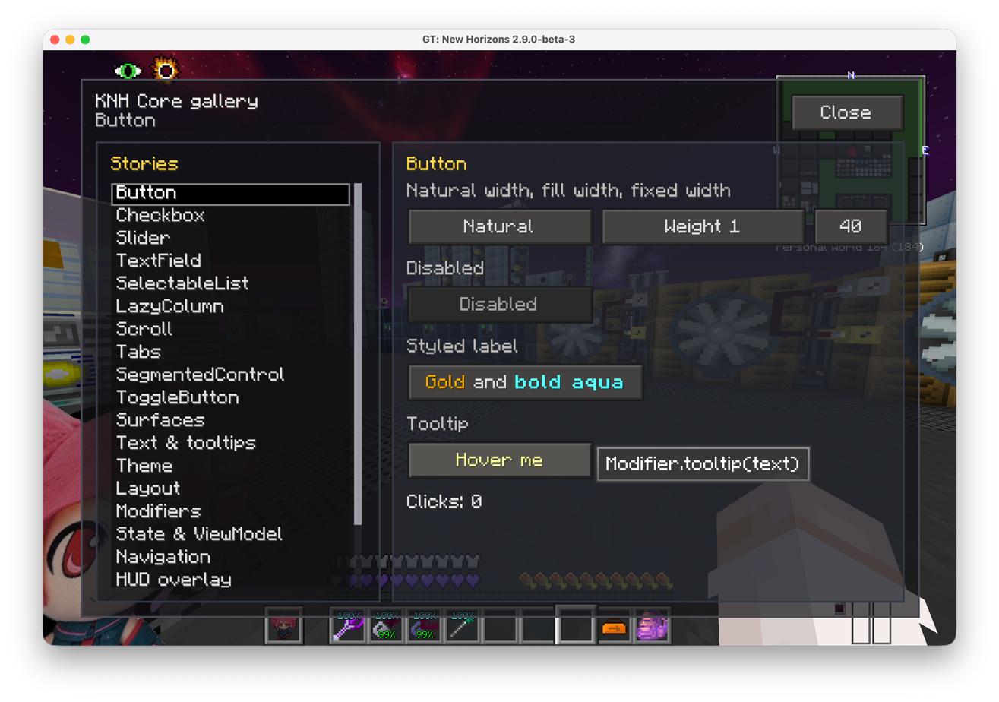
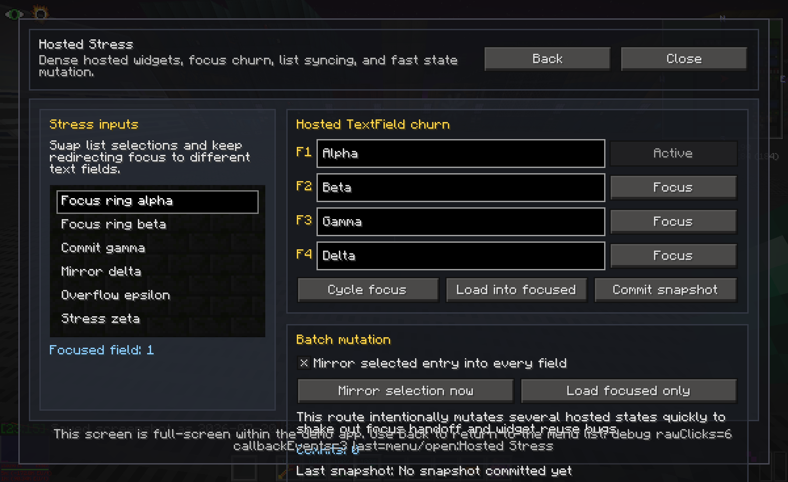

# Test GUI

Test GUI is a client-only showcase and stress-test mod for the [KNH Core](../../framework/) Compose Runtime GUI framework. It is intended for framework development, not normal modpack play.






## Running the showcase

Install `testgui`, KNH Core, and Forgelin in a development instance, then run:

```text
/testgui
```

The command opens a full-screen demo app with typed navigation and focused examples.

## Demo catalog

| Screen | Coverage |
| --- | --- |
| Overview | Demo launcher and top-level navigation. |
| Controls | Native buttons, checkboxes, sliders, tabs, segmented controls, and composite components. |
| Text & Tooltips | Wrapped text, Minecraft colors, styled spans and labels, and tooltip modifiers. |
| Inputs & Lists | Hosted text fields, focus handling, selection, and view-model-backed summaries. |
| Layout & Scroll | Boxes, rows, columns, panels, alignment, weight, offsets, and scroll state. |
| State Lab | AndroidX `ViewModel`, `StateFlow`, lifecycle-aware collection, `remember`, and `rememberSaveable`. |
| Navigation | Typed destinations, nested `NavHost`, duplicate routes, replace-top, pop, and back handling. |
| Hosted Stress | Dense native widgets, rapid focus changes, list-to-field synchronization, and batch mutation. |
| Scroll & Clip Stress | Long scroll regions, clipping, hit testing, offset content, and density changes. |

## Structure

Each screen is split into small model, view-model, route, and view files:

```text
*Model.kt
*ViewModel.kt
*Route.kt
*View.kt
```

Routes bind navigation, collect `StateFlow` with `collectAsStateWithLifecycle()`, and pass state and callbacks into stateless views. This keeps examples small enough to use as references and tests.

## Requirements

- GT New Horizons 2.9.0-beta-2 / Minecraft 1.7.10
- Forgelin
- KNH Core with the same version as Test GUI

## Build

From the repository root:

```bash
./gradlew -p framework publishToMavenLocal
./gradlew -p mods/testgui clean build
```

Artifact:

```text
mods/testgui/build/libs/testgui-<version>.jar
```
