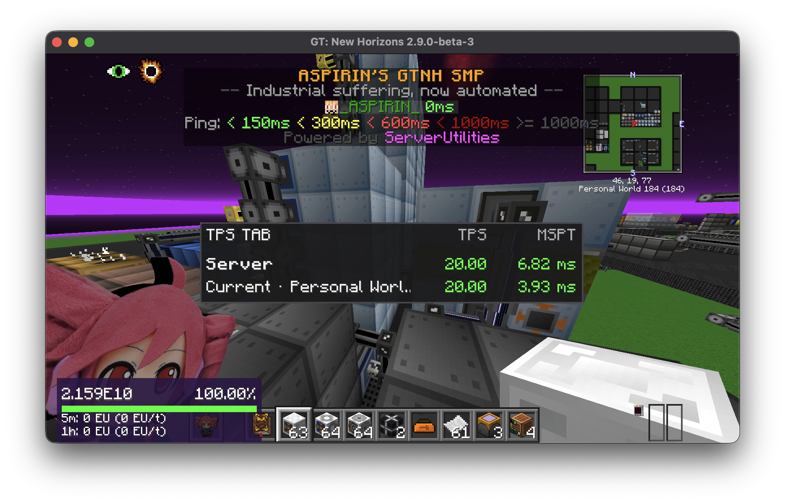

# TPS Tab

TPS Tab is an unsuccessful client-side experiment that tried to add server performance information below the multiplayer tab list.

> [!CAUTION]
> **This mod is not useful as an accurate TPS monitor and is not recommended for normal use.**
>
> The original goal was to expose profiling measurements from the CoFH profiler used in GTNH or from Opis, another Minecraft profiling tool. The meaningful data from both profilers is produced server-side and is not available to an ordinary client. Without a server-side component, the experiment could not obtain those measurements.
>
> What remains can only parse TPS text that a server already publishes or estimate activity from vanilla world-time synchronization packets. That fallback is not a relevant measurement of real server TPS/MSPT, so this module should be treated as a failed proof of concept retained for reference.



## What remains

TPS Tab passively looks for TPS/MSPT text already exposed through the player list or scoreboard. When an overall TPS line is unavailable, it estimates TPS from vanilla world-time synchronization packets.

It does not request privileged server data, run server commands, or use a server-side companion mod. Consequently, it cannot access the profiler data it was originally meant to display. The time-sync fallback should not be interpreted as authoritative server performance data.

## Features

- overall TPS and MSPT below the tab list
- current-dimension TPS and MSPT when the server publishes them
- passive fallback based on world-time packets
- stale-data indication
- hot-reloadable JSON configuration

## Requirements

- GT New Horizons 2.9.0-beta-2 / Minecraft 1.7.10
- Forgelin
- [KNH Core](../../framework/) with the same version as TPS Tab

TPS Tab is client-side and does not need to be installed on the server.

## Installation and use

Place `knh-core-<version>.jar` and `tps-tab-<version>.jar` in the instance's `mods/` directory. Join a world and hold the normal player-list key (`Tab`) to see the overlay.

The source label distinguishes server-published values from time-sync estimates. Until a source becomes available, the overlay shows a configurable waiting message.

## Configuration

TPS Tab creates `<instance>/config/tab_tps.json`:

```json
{
  "enabled": true,
  "staleDataTicks": 400,
  "showPlaceholder": true,
  "placeholderText": "Waiting for passive TPS data..."
}
```

The file is polled on client ticks, so changes take effect without restarting Minecraft. `staleDataTicks` controls how old a measurement can become before the overlay marks it as stale.

## Build

From the repository root:

```bash
./gradlew -p framework publishToMavenLocal
./gradlew -p mods/tps-tab clean build
```

Artifact:

```text
mods/tps-tab/build/libs/tps-tab-<version>.jar
```
